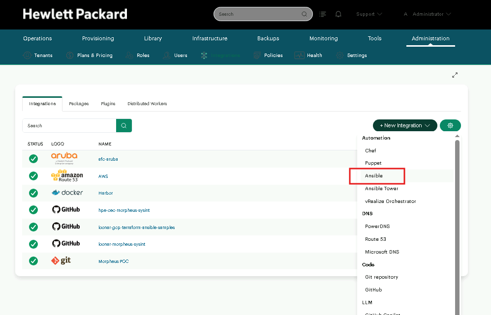
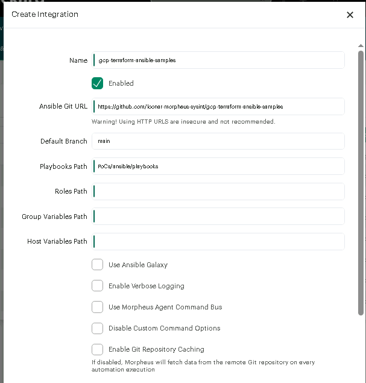
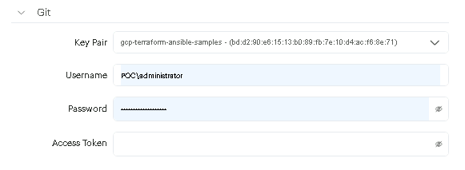

# HOWTO: Criação e Execução de Ansible Tasks na UI do Morpheus Data

Este guia ensina passo a passo como configurar e executar tarefas do tipo **Ansible Playbook** utilizando a interface web do Morpheus Data, aproveitando os playbooks deste repositório Git.

---

## 1. Pré-requisito: Integração do tipo Ansible no Morpheus

Antes de criar a Task, certifique-se de que a integração está devidamente configurada no Morpheus como uma integração do tipo **Ansible**:

> [!IMPORTANT]
> A integração deve ser criada obrigatoriamente como tipo **`Ansible`** (sob o grupo **Automation**) e **NÃO** como tipo *Git repository* ou *GitHub* (sob o grupo *Code*). A integração do tipo Ansible permite ao Morpheus mapear playbooks, papéis, variáveis e controlar o ciclo de vida.

### 1.1. Selecionando o Tipo de Integração

1. Acesse no menu principal: **Administration > Integrations**.
2. Clique no botão **`+ New Integration`**.
3. No dropdown, localize a seção **Automation** e selecione **`Ansible`**:

---

### 1.2. Configuração dos Caminhos (Paths) e Opções de Execução

Na tela de configuração da integração, preencha os parâmetros do repositório:

| Campo | Valor Obrigatório / Recomendado | Descrição / Observação |
|---|---|---|
| **Name** | `gcp-terraform-ansible-samples` | Nome identificador da integração no Morpheus |
| **Enabled** | `Marcado` (Ativo) | Habilita a integração |
| **Ansible Git URL** | `git@github.com:loonar-morpheus-sysint/gcp-terraform-ansible-samples.git` | URL no formato **SSH** do repositório |
| **Default Branch** | `main` | Branch padrão sincronizada |
| **Playbooks Path** | `PoCs/ansible/playbooks` | Caminho relativo onde ficam os playbooks `.yml` |
| **Roles Path** | `PoCs/ansible/roles` | **Obrigatório na validação da UI** (diretório com `.gitkeep`) |
| **Group Variables Path** | `PoCs/ansible/group_vars` | Caminho das variáveis de grupo (`morpheus.yml`) |
| **Host Variables Path** | `PoCs/ansible/host_vars` | **Obrigatório na validação da UI** (diretório com `.gitkeep`) |

#### Opções de Execução (Checkboxes):
* **Use Ansible Galaxy**: **Recomendado marcar**. Garante que as dependências declaradas em `PoCs/ansible/requirements.yml` (como a coleção `morpheus.core`) sejam instaladas/atualizadas automaticamente.
* **Disable Custom Command Options**: **Manter DESMARCADO**. Se marcado, bloqueia a passagem de variáveis extras (`-e`) nas Tasks, o que impediria a flexibilidade da PoC.
* **Use Morpheus Agent Command Bus**: *Opcional*. Se marcado, direciona os comandos Ansible através do canal criptografado do agente Morpheus nas VMs gerenciadas, sem exigir abertura de porta SSH (22) inbound.
* **Enable Git Repository Caching**: *Opcional*. Mantém cache local no appliance para acelerar clones frequentes.

---

### 1.3. Autenticação com o Repositório Git (Key Pair SSH)

Na seção **Git** do formulário de integração:

1. **Key Pair (Obrigatório)**: 
   * O Morpheus exige a seleção de uma **Key Pair** cadastrada previamente em **Infrastructure > Keys & Certs**.
   * Selecione a chave correspondente (ex.: `gcp-terraform-ansible-samples`).
   * A chave pública dessa Key Pair deve estar cadastrada no GitHub como uma **Deploy Key** do repositório (com permissão de leitura).
2. **Username / Password / Access Token**:
   * Como a autenticação é realizada via **Key Pair (SSH)**, esses campos **devem permanecer em branco**.
   * ⚠️ *Atenção ao gerenciador de senhas do navegador: limpe qualquer preenchimento automático em `Username` ou `Password` para evitar conflitos de autenticação.*
3. Clique em **`SAVE CHANGES`** e aguarde a sincronização inicial (status verde ✅).

---

## 2. Criando uma Ansible Task na Interface Web

1. Navegue até: **Library > Automation > Tasks** (ou **Library > Tasks**).
2. Clique no botão **`+ ADD`** no canto superior direito.
3. No modal de seleção de tipo, escolha **`Ansible Playbook`**.

### Campos do Formulário:

| Campo | Valor Recomendado / Exemplo | Descrição |
|---|---|---|
| **NAME** | `GCP - Restart VM Playbook` | Nome amigável da tarefa |
| **CODE** | `gcp-restart-vm-task` | Identificador único interno |
| **REPOSITORY** | `gcp-terraform-ansible-samples` | Selecione seu repositório Git |
| **GIT REF** | `main` | Branch ou tag Git |
| **PLAYBOOK** | `04-manage-instance.yml` | Nome do playbook relativo ao *Playbooks Path* |
| **COMMAND OPTIONS** | `-e "target_instance_name=vm-gcp-poc target_state=restarted"` | Variáveis extras passadas ao Ansible |
| **EXECUTE TARGET** | `Local` *(para chamadas na API Morpheus)* ou `Specified Host` | Onde o binário do Ansible roda |
| **RETRYABLE** | `Marcado` (Opcional) | Permite retentar em caso de falha |

4. Clique em **`SAVE CHANGES`**.

---

## 3. Exemplos Práticos de Configuração de Tasks

### Exemplo A: Task de Snapshot Preventivo
- **Name**: `GCP - Criar Snapshot de VM`
- **Playbook**: `05-instance-snapshot.yml`
- **Command Options**: `-e "target_instance_name=vm-gcp-poc snapshot_action=present snapshot_name=Pre-Manutencao"`
- **Execute Target**: `Local`

### Exemplo B: Task de Configuração de SO / Nginx
- **Name**: `GCP - Instalar Pacotes e Nginx`
- **Playbook**: `09-configure-with-inventory.yml`
- **Command Options**: `-e "ansible_user=devopsvanilla enable_nginx_example=true"`
- **Execute Target**: `Morpheus Agent` ou `Remote` (SSH)

---

## 4. Executando a Task Manualmente

1. Na lista de **Tasks** (**Library > Automation > Tasks**):
2. Localize a task desejada (ex: `GCP - Criar Snapshot de VM`).
3. Clique no menu de ações laterais (ícone `...` ou botão de engrenagem) e selecione **`Execute`**.
4. No modal **EXECUTE TASK?**:
   - **CONTEXT TYPE**: Selecione **`None`** (para execução local independente de host) ou **`Instance`** (para associar ao histórico de uma VM específica).
5. Clique em **`EXECUTE`**.

---

## 5. Visualizando os Logs em Tempo Real

1. Navegue até: **Operations > Activity > Executions**.
2. Clique no job correspondente à sua execução recente.
3. Na aba **Output**, você verá o console colorido do Ansible com o streaming ao vivo do *stdout* e *stderr*.
4. O status mudará visualmente para:
   - 🟢 **Success** (Verde): Playbook executado com sucesso.
   - 🔴 **Failed** (Vermelho): Exibirá a stack trace exata da falha para diagnóstico rápido.
