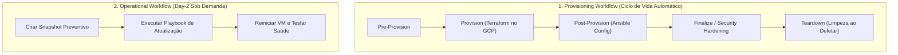

# HOWTO: Construtor Visual de Workflows e Ciclo de Vida (Provisioning & Day-2)

Este guia ensina como encadear automações Ansible em **Workflows Visuais** no Morpheus Data, integrando o ciclo de vida de VMs no Google Cloud Platform (GCP).

---

## 1. Tipos de Workflows no Morpheus Data

O Morpheus oferece dois tipos principais de Workflows:

---

## 2. Como Criar um Provisioning Workflow (Automação Pós-Provisionamento)

Quando uma VM é provisionada no GCP via Blueprint ou Terraform, o Morpheus pode rodar o Ansible automaticamente na fase **Post-Provision**.

### Passo a Passo:

1. Acesse: **Provisioning > Automation > Workflows**.
2. Clique no botão **`+ ADD`**.
3. No campo **WORKFLOW TYPE**, selecione: **`Provisioning`**.
4. Preencha os metadados:
   - **NAME**: `GCP VM - Base Setup & Hardening`
   - **CODE**: `gcp-vm-base-workflow`
   - **PLATFORM**: `Linux`
5. Na seção visual de fases do ciclo de vida:
   - Localize a fase **`POST-PROVISION`**.
   - Clique em **`+ ADD TASK`**.
   - Selecione a task: `GCP - Instalar Pacotes e Nginx` (criada a partir do playbook `09-configure-with-inventory.yml`).
   - *(Opcional)* Na fase **`TEARDOWN`**, adicione uma task de limpeza ou desregistro de licenças.
6. Clique em **`SAVE CHANGES`**.

---

## 3. Como Vincular o Workflow a uma Instância ou Blueprint

Para que o Workflow execute automaticamente sempre que uma VM for provisionada:

1. Vá em **Library > Blueprints** (ou **Provisioning > Instances** ao provisionar manualmente).
2. Selecione o Blueprint da VM GCP (ex: `gcp-create-vm-native`).
3. Na aba **Automation** da configuração da instância:
   - No campo **WORKFLOW**, selecione: `GCP VM - Base Setup & Hardening`.
4. Salve e publique. Ao clicar em *Provision*, o Morpheus subirá a VM no GCP e imediatamente executará o playbook Ansible.

---

## 4. Como Criar um Operational Workflow (Operação Day-2 Sob Demanda)

Workflows operacionais servem para executar tarefas de rotina, manutenção e auditoria em VMs que já estão em produção.

### Passo a Passo:

1. Acesse: **Provisioning > Automation > Workflows**.
2. Clique em **`+ ADD`**.
3. No campo **WORKFLOW TYPE**, selecione: **`Operational`**.
4. Preencha:
   - **NAME**: `GCP VM - Manutenção com Snapshot e Restart`
   - **CODE**: `gcp-vm-maintenance-workflow`
5. Na seção de tasks, adicione as tarefas na ordem de execução desejada:
   - **Task 1**: `GCP - Criar Snapshot de VM` (Playbook `05-instance-snapshot.yml`).
   - **Task 2**: `GCP - Aplicar Patches de SO` (Playbook de apt/update).
   - **Task 3**: `GCP - Restart Controlado` (Playbook `04-manage-instance.yml` com `target_state=restarted`).
6. Clique em **`SAVE CHANGES`**.

Agora este workflow pode ser acionado com um clique em qualquer VM ou agendado no calendário (*Jobs*).
