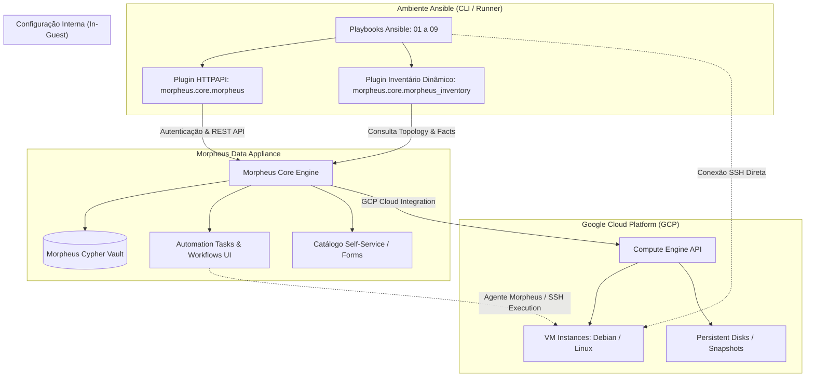

# Relatório Técnico de Problemas: Integração e Automação de VMs GCP no Morpheus Data com Ansible

```text
**Documento**: `ISSUES-ansible.md`  
**Autor**: Sandro Cicero - Loonar
**Destinatário**: Engenharia - Morpheus Data, HPE
**Data**: 31 de Agosto de 2026
**Status**: Aberto para Diagnóstico e Recomendações  
```

---

## 1. Introdução e Arquitetura da Solução

### 1.1. Objetivo da Arquitetura

O objetivo desta Prova de Conceito (PoC) é estabelecer a integração, orquestração e gerenciamento operacional (Day-1 e Day-2) de Máquinas Virtuais provisionadas no [Google Cloud Platform (GCP)](https://cloud.google.com/compute) através da plataforma [Morpheus Data](https://docs.morpheusdata.com/), utilizando o [Ansible](https://docs.ansible.com/) e a coleção oficial [`morpheus.core`](https://galaxy.ansible.com/ui/repo/published/morpheus/core/) desenvolvida pela Hewlett Packard Enterprise (HPE).

A arquitetura contempla múltiplos modelos operacionais suportados pelo ecossistema Morpheus e Ansible:

1. **Automação via Control Plane / API (Outside-In)**: Execução de playbooks Ansible a partir de runners/estações externas interagindo com a API REST do Morpheus via plugin HTTPAPI (`morpheus.core.morpheus`) para gerenciar o ciclo de vida das VMs (start, stop, restart, snapshots, keypairs e segredos no Cypher Vault).
2. **Inventário Dinâmico em Tempo Real**: Consulta automática à topologia da Cloud GCP cadastrada no Morpheus utilizando o plugin `morpheus.core.morpheus_inventory`, agrupando instâncias por tags, clouds, status ou grupos de infraestrutura.
3. **Automação Nativa na Console Morpheus (Inside-Out)**: Execução de Ansible Tasks e Workflows de Provisionamento/Day-2 diretamente pelo appliance Morpheus, com injeção de parâmetros via Catálogo de Serviços Self-Service e menus contextuais (*Instance Actions*).
4. **Configuração Interna de Sistema Operacional**: Execução de playbooks via SSH nas instâncias Compute Engine do GCP a partir dos alvos resolvidos dinamicamente pelo Morpheus.



---

### 1.2. Recursos Utilizados

#### A. Recursos Morpheus Data e Coleção Ansible (`morpheus.core`)

* **Coleção Ansible Oficial**: [`morpheus.core`](https://github.com/HewlettPackard/ansible-collection-morpheus-core) (definida em [`requirements.yml`](./requirements.yml)).
* **Plugins Especializados**:
  * `morpheus.core.morpheus` (HTTPAPI Plugin): Camada de transporte seguro via REST API com suporte a Access Token e credenciais de usuário.
  * `morpheus.core.morpheus_inventory` (Inventory Plugin): Descoberta e agrupamento dinâmico de instâncias GCP em tempo real (configurado em [`inventory/morpheus_inventory.yml`](./inventory/morpheus_inventory.yml)).
* **Módulos de Operação e Gerenciamento**:
  * [`morpheus.core.instance`](https://github.com/HewlettPackard/ansible-collection-morpheus-core/blob/main/docs/morpheus.core.instance_module.rst): Gerenciamento de ciclo de vida e energia (`started`, `stopped`, `restarted`, `backup`, `delete`).
  * [`morpheus.core.instance_info`](https://github.com/HewlettPackard/ansible-collection-morpheus-core/blob/main/docs/morpheus.core.instance_info_module.rst): Consulta de inventário, metadados de rede, IPs e status de energia.
  * [`morpheus.core.instance_snapshot`](https://github.com/HewlettPackard/ansible-collection-morpheus-core/blob/main/docs/morpheus.core.instance_snapshot_module.rst) e `instance_snapshot_info`: Criação, reversão e listagem de snapshots de VMs GCP.
  * [`morpheus.core.cypher`](https://github.com/HewlettPackard/ansible-collection-morpheus-core/blob/main/docs/morpheus.core.cypher_module.rst) e `cypher_info`: Leitura e escrita de segredos, senhas e variáveis no Cypher Vault.
  * [`morpheus.core.key_pair`](https://github.com/HewlettPackard/ansible-collection-morpheus-core/blob/main/docs/morpheus.core.key_pair_module.rst) e `key_pair_info`: Gerenciamento de chaves públicas/privadas SSH para acesso às VMs.
  * [`morpheus.core.cloud_info`](https://github.com/HewlettPackard/ansible-collection-morpheus-core/blob/main/docs/morpheus.core.cloud_info_module.rst) e `group_info`: Descoberta de clouds integradas (GCP) e grupos de infraestrutura.
* **Recursos de Automação na Console Morpheus**:
  * **Ansible Tasks na UI**: Execução de playbooks armazenados no Git através do runner interno (guia [`HOWTO-ansible-tasks-ui.md`](./HOWTO-ansible-tasks-ui.md)).
  * **Workflows de Lifecycle (Provisioning & Day-2)**: Encadeamento de tarefas nos estágios de inicialização e manutenção (guia [`HOWTO-workflows-lifecycle.md`](./HOWTO-workflows-lifecycle.md)).
  * **Instance Actions (Menu de Ações Day-2)**: Disponibilização de playbooks operacionais diretamente no menu da VM (guia [`HOWTO-instance-actions-day2.md`](./HOWTO-instance-actions-day2.md)).
  * **Catálogo de Serviços Self-Service**: Exposição de automações com formulários visuais dinâmicos via Option Types / Inputs (guia [`HOWTO-service-catalog-forms.md`](./HOWTO-service-catalog-forms.md)).

#### B. Recursos Ansible Core e Estrutura de Automação

* **Ansible Core Engine**: Configurado via [`ansible.cfg`](./ansible.cfg) com habilitação explícita dos plugins HTTPAPI e Inventory da coleção `morpheus.core`.
* **Playbooks Modulares da PoC**:
  * [`playbooks/01-setup-check.yml`](./playbooks/01-setup-check.yml): Validação de autenticação, conectividade e coleta de facts do appliance.
  * [`playbooks/02-list-clouds.yml`](./playbooks/02-list-clouds.yml): Consulta de clouds cadastradas com foco na cloud Google Cloud Platform.
  * [`playbooks/03-list-instances.yml`](./playbooks/03-list-instances.yml): Listagem e filtragem de instâncias Compute Engine.
  * [`playbooks/04-manage-instance.yml`](./playbooks/04-manage-instance.yml): Controle de energia e estado operacional das VMs.
  * [`playbooks/05-instance-snapshot.yml`](./playbooks/05-instance-snapshot.yml): Gerenciamento preventivo e recuperação de snapshots.
  * [`playbooks/06-manage-keypairs.yml`](./playbooks/06-manage-keypairs.yml): Gestão de pares de chaves SSH no Morpheus.
  * [`playbooks/07-manage-cypher-secrets.yml`](./playbooks/07-manage-cypher-secrets.yml): Leitura e gravação de chaves no Cypher.
  * [`playbooks/08-full-lifecycle.yml`](./playbooks/08-full-lifecycle.yml): Orquestração ponta a ponta (consulta metadados -> snapshot -> reinicialização).
  * [`playbooks/09-configure-with-inventory.yml`](./playbooks/09-configure-with-inventory.yml): Configuração in-guest via inventário dinâmico.
* **Inventários e Variáveis**:
  * [`inventory/hosts.yml`](./inventory/hosts.yml): Inventário estático para execução contra o control plane do Morpheus.
  * [`inventory/morpheus_inventory.yml`](./inventory/morpheus_inventory.yml): Definição do inventário dinâmico com agrupamento por Cloud GCP.
  * [`group_vars/morpheus.yml`](./group_vars/morpheus.yml): Definições de parâmetros de conexão e credenciais.

#### C. Recursos Google Cloud Platform (GCP)

* **Google Compute Engine (GCE)**: Máquinas virtuais gerenciadas pelo Morpheus Data e operadas via playbooks Ansible.
* **Persistent Disk Snapshots**: Snapshots criados e mantidos via API do Morpheus integrando com a infraestrutura de armazenamento do GCP.
* **VPC Networking & Firewalls**: Acesso SSH administrativo nas instâncias via porta 22 para execução de tarefas de configuração interna de sistema operacional.

---

## 2. Problemas Encontrados

<!-- 
Esta seção deve ser preenchida detalhando os problemas técnicos identificados, 
comportamentos observados, mensagens de erro/logs e as abordagens tentadas.
-->

### 2.1. Integração com o Git / GitHub (Autenticação HTTPS vs SSH)

* **Descrição**:
  Durante a configuração da integração do Morpheus Data com o repositório de código no GitHub para sincronização dos playbooks Ansible, **somente foi possível obter sucesso na integração utilizando chave SSH**. As tentativas de integração através de **Username / Password** e **Access Token (PAT)** via HTTPS não funcionaram.

* **Cenário / Recurso Envolvido**:
  * Menu: *Administration > Integrations > Code Repositories* (ou *Provisioning > Code > Repositories*).
  * Tipo de Integração: Git / GitHub Repository SCM.
  * Automações dependentes: Ansible Tasks (UI) e Workflows que consomem playbooks versionados no Git.

* **Comportamento Observado**:
  1. **Autenticação HTTPS (Username / Password e Personal Access Token)**: A sincronização do repositório falhou sistematicamente ao tentar validar as credenciais ou clonar os playbooks pelo appliance Morpheus.
  2. **Autenticação SSH (SSH Keypair)**: A sincronização funcionou imediatamente após cadastrar a chave privada no Morpheus (KeyPair / Cypher) e a correspondente chave pública como *Deploy Key* no GitHub.

* **Evidência Visual da Configuração**:

  

* **Análise Técnica Preliminar e Impacto**:
  * A dependência obrigatória de chaves SSH impacta ambientes corporativos que restringem o uso de chaves assimétricas SSH individuais em favor de Tokens de Serviço com escopo granular (*GitHub Fine-grained PATs* ou *GitHub Apps*).

---

### 2.2. Tela de Resumo da Integração Ansible (`admin/integrations/<ID>`)

* **Descrição**:
  Ao acessar a tela de detalhes e gerenciamento da integração Ansible configurada no Morpheus (rota `/admin/integrations/<ID>`), foram identificadas inconsistências na sincronização de dados e falha de execução na interface:
  1. **Abas *Roles* e *Inventory* vazias**: As abas *Roles* e *Inventory* não exibiram as configurações existentes no repositório Git vinculado, mesmo com os caminhos devidamente parametrizados na configuração da integração.
  2. **Erro de execução em *Actions > Run Playbook***: O acionamento da opção *Actions > Run Playbook* falha ao carregar o modal de disparo, exibindo a seguinte exceção no console/interface:
     ```text
     jOr is not a function or its return value is not iterable
     ```

* **Cenário / Recurso Envolvido**:
  * Menu: *Administration > Integrations > [Integração Ansible]* (`/admin/integrations/<ID>`).
  * Abas afetadas: *Roles*, *Inventory* e menu *Actions > Run Playbook*.
  * Arquivos de configuração: [`ansible.cfg`](./ansible.cfg), diretórios [`roles/`](./roles) e [`inventory/`](./inventory).

* **Comportamento Observado**:
  * **Visualização de Roles e Inventários**: Embora o repositório possua playbooks, roles e inventários válidos, o Morpheus sincroniza apenas a listagem básica de playbooks, mantendo as abas *Roles* e *Inventory* vazias sem apontar erros de parsing no log principal.
  * **Disparo Rápido de Playbook**: Ao clicar em *Actions > Run Playbook*, a interface não abre o assistente de execução e trava com a mensagem de erro JavaScript supracitada, sugerindo um *TypeError* no bundle minificado do frontend do Morpheus ao tentar iterar sobre a coleção de playbooks ou inventários retornada pela API interna.

* **Análise Técnica Preliminar e Impacto**:
  * A falha no carregamento dos inventários/roles na UI e o erro de iteração no frontend impedem o uso operacional direto da tela de Integração para validações e disparos rápidos de playbooks (*ad-hoc executions*).
  * Como contorno, a execução precisa ser encapsulada obrigatoriamente dentro de *Ansible Tasks* individuais em *Library > Automation > Tasks*, aumentando o overhead de configuração e manutenção.


---

## 3. Conclusão e Questionamentos para o Suporte Morpheus Data

<!-- 
Esta seção conterá a síntese técnica dos desafios encontrados e os questionamentos
específicos direcionados à equipe de suporte/engenharia da Morpheus Data e HPE.
-->

### 3.1. Síntese do Diagnóstico

---

### 3.2. Questionamentos à Engenharia da Morpheus Data

> [!NOTE] **Oportunidade de Melhoria Contínua e Parceria Técnica: Documentação e Exemplos Práticos**
> Identificamos como uma excelente oportunidade de evolução conjunta o aprofundamento da documentação oficial com exemplos práticos *end-to-end* e guias detalhados de exploração para cenários avançados de integração. 
> 
> Durante a implementação desta Prova de Conceito, observamos que a velocidade de adoção e a curva de aprendizado foram impactadas pela necessidade de ciclos iterativos de tentativa e erro, inspeção aprofundada de logs e certa incerteza técnica sobre quais abordagens representam as melhores práticas recomendadas pela plataforma. 
> 
> A inclusão de arquiteturas de referência documentadas, tutoriais de casos de uso reais e o detalhamento dos mecanismos internos de integração trarão expressivo ganho de produtividade, acelerando o *time-to-value*, fortalecendo a experiência do desenvolvedor e garantindo a consolidação dos padrões arquiteturais recomendados pela Morpheus Data.

---

## 4. Referências Técnicas Utilizadas

### 4.1. Documentação Oficial Morpheus Data e HPE
* [Morpheus Data Documentation Hub](https://docs.morpheusdata.com/)
* [Morpheus Ansible Integration Guide](https://docs.morpheusdata.com/en/latest/integration_guides/Automation/ansible.html)
* [Morpheus Automation & Tasks Guide](https://docs.morpheusdata.com/en/latest/tools/automation/automation.html)
* [Morpheus Workflows & Provisioning Phases](https://docs.morpheusdata.com/en/latest/tools/automation/workflows.html)
* [Morpheus Cypher Architecture & Vault Usage](https://docs.morpheusdata.com/en/latest/tools/cypher/cypher.html)
* [Morpheus Service Catalog & Option Types](https://docs.morpheusdata.com/en/latest/library/catalog/catalog.html)
* [Morpheus REST API Documentation](https://apidocs.morpheusdata.com/)
* [Ansible Galaxy: Coleção `morpheus.core`](https://galaxy.ansible.com/ui/repo/published/morpheus/core/)
* [Repositório GitHub: `HewlettPackard/ansible-collection-morpheus-core`](https://github.com/HewlettPackard/ansible-collection-morpheus-core)

### 4.2. Documentação Ansible
* [Ansible Documentation Hub](https://docs.ansible.com/ansible/latest/)
* [Ansible HTTPAPI Connection Plugins](https://docs.ansible.com/ansible/latest/plugins/httpapi.html)
* [Ansible Dynamic Inventory Plugins Guide](https://docs.ansible.com/ansible/latest/inventory_guide/intro_dynamic_inventory.html)
* [Ansible Galaxy Collections User Guide](https://docs.ansible.com/ansible/latest/collections_guide/collections_using_playbooks.html)
* [Ansible Vault Security Guide](https://docs.ansible.com/ansible/latest/vault_guide/index.html)

### 4.3. Google Cloud Platform (GCP)
* [Google Compute Engine Documentation](https://cloud.google.com/compute/docs)
* [Google Compute Engine: Managing VM Instances](https://cloud.google.com/compute/docs/instances)
* [Google Compute Engine: Disks and Snapshots](https://cloud.google.com/compute/docs/disks)
* [Google Cloud VPC Firewall Rules](https://cloud.google.com/firewall/docs/firewalls-overview)

### 4.4. Artefatos e Código da PoC no Repositório
* [PoC Ansible README](./README.md) - Documentação geral da PoC e guia de execução.
* [Ansible Configuration (`ansible.cfg`)](./ansible.cfg) - Configuração do engine Ansible e plugins.
* [Ansible Collections Requirements (`requirements.yml`)](./requirements.yml) - Declaração da dependência `morpheus.core`.
* [Static Inventory (`inventory/hosts.yml`)](./inventory/hosts.yml) - Inventário do control plane Morpheus.
* [Dynamic Inventory Configuration (`inventory/morpheus_inventory.yml`)](./inventory/morpheus_inventory.yml) - Configuração do plugin de inventário dinâmico.
* [Connection Variables (`group_vars/morpheus.yml`)](./group_vars/morpheus.yml) - Definição de credenciais e endpoint Morpheus.
* [Guide: Ansible Tasks na UI (`HOWTO-ansible-tasks-ui.md`)](./HOWTO-ansible-tasks-ui.md) - Criação e execução de tasks Ansible no appliance.
* [Guide: Workflows de Lifecycle (`HOWTO-workflows-lifecycle.md`)](./HOWTO-workflows-lifecycle.md) - Automações de provisionamento e Day-2.
* [Guide: Instance Actions (`HOWTO-instance-actions-day2.md`)](./HOWTO-instance-actions-day2.md) - Disponibilização de ações no menu de contexto das VMs.
* [Guide: Service Catalog Forms (`HOWTO-service-catalog-forms.md`)](./HOWTO-service-catalog-forms.md) - Publicação de playbooks no portal Self-Service com formulários.
* [Automated Setup Script (`scripts/setup.sh`)](./scripts/setup.sh) - Script de instalação de dependências e coleções.
