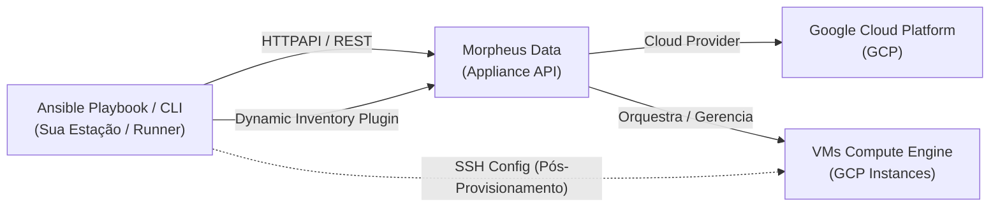

# PoC: Gerenciamento e Configuração de VMs GCP no Morpheus Data com Ansible

Esta PoC demonstra como utilizar a coleção oficial [`morpheus.core`](https://github.com/HewlettPackard/ansible-collection-morpheus-core) da Hewlett Packard Enterprise para automatizar, orquestrar e configurar Máquinas Virtuais (VMs) provisionadas no Google Cloud Platform (GCP) através da plataforma **Morpheus Data**.

---

## 🏛️ Arquitetura de Integração

O diagrama abaixo ilustra o fluxo de controle e comunicação entre o Ansible, a API do Morpheus Data e o provedor GCP:



---

## 📦 O que é Possível Fazer com a Coleção `morpheus.core`

A coleção `morpheus.core` oferece um conjunto completo de plugins, módulos e roles:

### 1. Plugins Especializados
- **`morpheus.core.morpheus_inventory` (Inventory Plugin)**: Consulta em tempo real a API do Morpheus e gera inventários dinâmicos de hosts agrupados por cloud (GCP), labels, tags, apps ou regex de nomes.
- **`morpheus.core.morpheus` (HTTPAPI Plugin)**: Camada de transporte segura via REST API do Morpheus com suporte a API Tokens e autenticação baseada em usuário/senha.

### 2. Módulos de Operação e Gerenciamento
| Módulo | Finalidade |
|---|---|
| `morpheus.core.instance` | **Gerencia VMs**: start, stop, restart, lock, suspend, backup, delete, eject |
| `morpheus.core.instance_info` | Consulta metadados, IPs, status de energia e detalhes de instâncias |
| `morpheus.core.instance_snapshot` | Cria, lista, reverte e remove snapshots de instâncias |
| `morpheus.core.instance_snapshot_info` | Consulta histórico de snapshots de uma VM |
| `morpheus.core.cypher` | Armazena, lê e exclui segredos, senhas e tfvars no Cypher Vault |
| `morpheus.core.cypher_info` | Lista chaves e segredos armazenados no Cypher |
| `morpheus.core.key_pair` | Cria, gera ou importa pares de chaves SSH no Morpheus |
| `morpheus.core.key_pair_info` | Lista pares de chaves SSH cadastradas |
| `morpheus.core.cloud_info` | Consulta clouds cadastradas (incluindo o Cloud GCP) |
| `morpheus.core.cloud_type_info` | Lista provedores de cloud suportados |
| `morpheus.core.group_info` | Consulta grupos de infraestrutura |
| `morpheus.core.appliance_facts` | Coleta facts do appliance Morpheus (versão, status, licença) |
| `morpheus.core.appliance_settings` | Configura opções globais do Morpheus |
| `morpheus.core.ssl_certificate` | Gerencia certificados SSL no appliance |
| `morpheus.core.tenant` / `tenant_info` | Gerencia tenants e sublocatários |
| `morpheus.core.virtual_image` | Gerencia imagens e templates de SO |

### 3. Roles Incluídas
A coleção inclui roles para automação completa de configuração da plataforma Morpheus: `clouds`, `groups`, `instancetypes`, `integrations`, `keyscerts`, `layouts`, `nodetypes`, `optionlists`, `optiontypes`, `settings`, `tasksrole`, `tenants`, `userroles`, `users`, `virtualimages` e `workflows`.

---

## 📁 Estrutura de Arquivos da PoC

```
PoCs/ansible/
├── README.md                           # Esta documentação
├── HOWTO-ansible-tasks-ui.md          # Guia: Criar e Executar Ansible Tasks na UI
├── HOWTO-workflows-lifecycle.md       # Guia: Workflows de Provisionamento e Day-2
├── HOWTO-instance-actions-day2.md     # Guia: Ações Diretas na VM (Menu Actions)
├── HOWTO-service-catalog-forms.md     # Guia: Publicar Playbooks no Catálogo Self-Service
├── requirements.yml                    # Definição da coleção morpheus.core
├── ansible.cfg                         # Configurações do Ansible e plugins
├── group_vars/
│   ├── morpheus.yml                    # Variáveis de conexão com o Morpheus
│   └── morpheus.example.yml            # Template de variáveis
├── inventory/
│   ├── hosts.yml                       # Inventário estático para tarefas HTTPAPI
│   └── morpheus_inventory.yml          # Configuração do inventário dinâmico
├── playbooks/
│   ├── 01-setup-check.yml             # 1. Validar conexão e coletar facts
│   ├── 02-list-clouds.yml             # 2. Listar Clouds e Grupos (foco GCP)
│   ├── 03-list-instances.yml          # 3. Listar VMs/Instâncias provisionadas
│   ├── 04-manage-instance.yml         # 4. Iniciar / Parar / Reiniciar VMs
│   ├── 05-instance-snapshot.yml       # 5. Criar / Reverter / Deletar Snapshots
│   ├── 06-manage-keypairs.yml         # 6. Gerenciar chaves SSH no Morpheus
│   ├── 07-manage-cypher-secrets.yml   # 7. Gerenciar segredos no Cypher Vault
│   ├── 08-full-lifecycle.yml          # 8. Fluxo completo (info -> snapshot -> restart)
│   └── 09-configure-with-inventory.yml # 9. Configurar SO interno via inventário dinâmico
└── scripts/
    └── setup.sh                        # Script automatizado de instalação
```

---

## 🚀 Instalação e Pré-requisitos

### 1. Executar o Script de Setup
O script instala as dependências Python (`requests`, `packaging`) e a coleção Ansible:

```bash
cd PoCs/ansible
./scripts/setup.sh
```

Ou manualmente:
```bash
ansible-galaxy collection install -r requirements.yml
python3 -m pip install requests packaging
```

---

## ⚙️ Configuração de Credenciais

As credenciais do Morpheus estão configuradas em `group_vars/morpheus.yml` e `inventory/hosts.yml`.

> [!TIP]
> Para proteger credenciais em ambientes produtivos, utilize o Ansible Vault:
> ```bash
> ansible-vault encrypt group_vars/morpheus.yml
> ```

---

## 🛠️ Guia Prático de Execução dos Playbooks

### 1. Verificação de Conectividade e Facts
Valida se o Ansible consegue se autenticar e comunicar com o Morpheus Appliance:
```bash
ansible-playbook playbooks/01-setup-check.yml
```

### 2. Listar Clouds e Grupos de Infraestrutura (GCP)
Descobre todas as clouds e grupos configurados no Morpheus, destacando a cloud GCP:
```bash
ansible-playbook playbooks/02-list-clouds.yml
```

### 3. Listar Instâncias (VMs) no Morpheus
Lista todas as VMs existentes gerenciadas pelo Morpheus:
```bash
# Listar todas:
ansible-playbook playbooks/03-list-instances.yml

# Filtrar por nome:
ansible-playbook playbooks/03-list-instances.yml -e "filter_name=vm-gcp"
```

### 4. Gerenciar Estado Operacional de VMs (Start / Stop / Restart)
Controla o ciclo de energia das instâncias no GCP:
```bash
# Iniciar VM:
ansible-playbook -i inventory/hosts.yml playbooks/04-manage-instance.yml \
  -e "target_instance_name=vm-gcp-poc target_state=started"

# Reiniciar VM:
ansible-playbook -i inventory/hosts.yml playbooks/04-manage-instance.yml \
  -e "target_instance_name=vm-gcp-poc target_state=restarted"

# Parar VM com simulação (Dry Run):
ansible-playbook -i inventory/hosts.yml playbooks/04-manage-instance.yml \
  -e "target_instance_name=vm-gcp-poc target_state=stopped" --check
```

### 5. Gerenciamento de Snapshots
Cria, reverte ou remove snapshots de segurança antes de manutenções:
```bash
# Criar snapshot:
ansible-playbook -i inventory/hosts.yml playbooks/05-instance-snapshot.yml \
  -e "target_instance_name=vm-gcp-poc snapshot_name='Snapshot-Pre-Deploy' snapshot_action=present"

# Reverter para o último snapshot:
ansible-playbook -i inventory/hosts.yml playbooks/05-instance-snapshot.yml \
  -e "target_instance_name=vm-gcp-poc snapshot_action=revert"
```

### 6. Gerenciamento de Chaves SSH
Cria ou importa pares de chaves SSH para provisionamento de VMs:
```bash
ansible-playbook -i inventory/hosts.yml playbooks/06-manage-keypairs.yml \
  -e "keypair_name=devopsvanilla-gcp-key keypair_action=present"
```

### 7. Gerenciamento de Segredos no Cypher Vault
Armazena e lê segredos de aplicação ou arquivos `tfvars` no cofre do Morpheus:
```bash
# Gravar secret:
ansible-playbook -i inventory/hosts.yml playbooks/07-manage-cypher-secrets.yml \
  -e "secret_name=db_password secret_value='M1nh@S3nh@F0rt3' secret_action=present"

# Gravar tfvars para Blueprints:
ansible-playbook -i inventory/hosts.yml playbooks/07-manage-cypher-secrets.yml \
  -e "secret_name=tfvars/gcp-create-vm-poc secret_mount=tfvars secret_value='env=\"poc\"' secret_action=present"
```

### 8. Ciclo de Vida Completo (End-to-End)
Executa o fluxo completo recomendado de operação:
1. Localiza a instância alvo e valida status
2. Gera snapshot de segurança preventivo
3. Executa reinicialização controlada
4. Valida se a VM retornou ao estado operacional saudável

```bash
ansible-playbook -i inventory/hosts.yml playbooks/08-full-lifecycle.yml \
  -e "target_instance_name=vm-gcp-poc"
```

---

## 🖥️ Guias Visuais no Morpheus Data (HOWTOs)

Para gerenciar, encadear e disparar esses playbooks de forma 100% visual na interface gráfica do Morpheus Data, consulte os guias práticos detalhados:

1. 📖 **[HOWTO: Criar e Executar Ansible Tasks na UI](HOWTO-ansible-tasks-ui.md)**
   - Cadastro de tasks `Ansible Playbook`, seleção de repositório Git, branches, command options e acompanhamento de logs ao vivo (*Executions*).
2. 📖 **[HOWTO: Workflows e Ciclo de Vida (Provisioning & Day-2)](HOWTO-workflows-lifecycle.md)**
   - Criação de pipelines em fases (`Post-Provision`, `Teardown`, `Operational`) combinando Terraform no GCP + Ansible.
3. 📖 **[HOWTO: Disparando Automações pelo Menu Actions da Instância](HOWTO-instance-actions-day2.md)**
   - Execução direta de playbooks a partir da tela de detalhes da VM GCP e auditoria na aba *History*.
4. 📖 **[HOWTO: Publicar Playbooks no Catálogo Self-Service com Formulários](HOWTO-service-catalog-forms.md)**
   - Criação de campos visuais (*Option Types / Inputs*) e itens de catálogo para que usuários finais solicitem automações via formulário web.

---

## 🌐 Utilizando o Inventário Dinâmico Morpheus

O plugin de inventário dinâmico consulta o Morpheus e descobre as VMs ativas na cloud GCP:

### Visualizar Inventário Dinâmico:
```bash
# Visualizar em árvore:
ansible-inventory -i inventory/morpheus_inventory.yml --graph

# Exportar formato JSON completo:
ansible-inventory -i inventory/morpheus_inventory.yml --list
```

### Configurar o Sistema Operacional das VMs Descobertas:
```bash
# Executa configurações (pacotes, timezone, etc.) nas VMs descobertas:
ansible-playbook -i inventory/morpheus_inventory.yml playbooks/09-configure-with-inventory.yml \
  -e "ansible_user=devopsvanilla"
```

---

## 🔍 Solução de Problemas Comuns (Troubleshooting)

| Sintoma | Causa Provável | Solução |
|---|---|---|
| `SSL: CERTIFICATE_VERIFY_FAILED` | Certificado autoassinado ou corporativo não reconhecido | Definir `morpheus_ssl_verify: false` e `ansible_httpapi_validate_certs: false` |
| `Authentication Failed (401/403)` | API token expirado ou usuário/senha inválidos | Verificar credenciais em `group_vars/morpheus.yml` e `inventory/hosts.yml` |
| `Plugin morpheus_inventory not found` | Coleção não encontrada no PATH do Ansible | Executar `./scripts/setup.sh` e checar `ansible.cfg` |
| `Instance not found` | Nome da VM divergente do cadastrado no Morpheus | Executar `playbooks/03-list-instances.yml` para consultar os nomes exatos |
