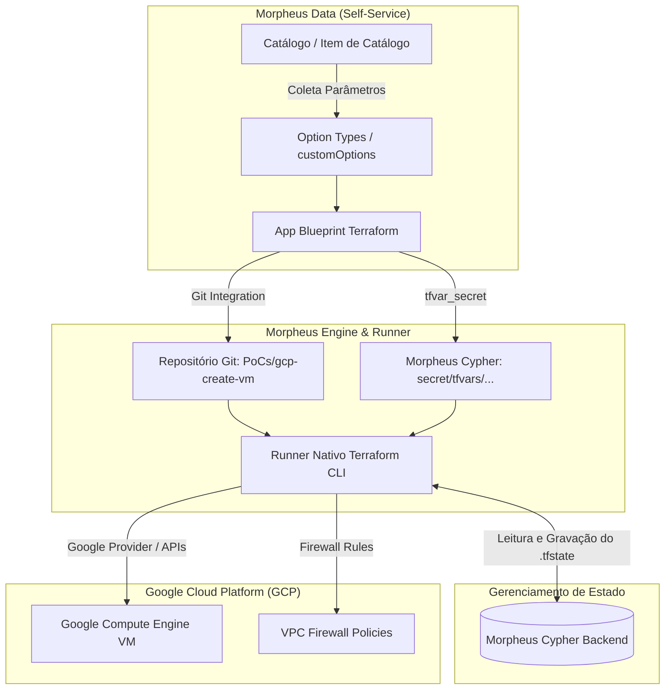

# Relatório Técnico de Problemas: Passagem de Parâmetros Dinâmicos em App Blueprints Nativos de Terraform no Morpheus Data

```text
**Documento**: `ISSUES-morpheus-tf-nativestate.md`  
**Autor**: Sandro Cicero - Loonar
**Destinatário**: Engenharia - Morpheus Data, HPE
**Data**: 31 de Agosto de 2026
**Status**: Aberto para Diagnóstico e Recomendações  
```

---

## 1. Introdução e Arquitetura da Solução

### 1.1. Objetivo da Arquitetura

O objetivo desta Prova de Conceito (PoC) é disponibilizar um **App Blueprint Nativo de Terraform** no [Morpheus Data](https://docs.morpheusdata.com/) via **Catálogo de Self-Service**, permitindo que usuários provisionem instâncias de Máquinas Virtuais no [Google Cloud Platform (GCP)](https://cloud.google.com/compute) com parâmetros customizáveis (ex.: nome da VM, vCPUs, memória RAM, tamanho e tipo de disco, chaves SSH e regras de firewall).

A arquitetura foi projetada para utilizar as capacidades nativas do Morpheus Data, garantindo:

1. **Runner Nativo de Terraform**: O Morpheus executa o ciclo de vida (`init`, `plan`, `apply`, `destroy`) a partir de um repositório Git integrado apontando para [`PoCs/gcp-create-vm`](../gcp-create-vm/main.tf).
2. **Gerenciamento Nativo de Estado no Morpheus Cypher**: O arquivo `.tfstate` é mantido e criptografado no [Morpheus Cypher](https://docs.morpheusdata.com/en/latest/tools/cypher/cypher.html), permitindo visibilidade de recursos, detecção de desvio de configuração (*Drift Detection*) e isolamento de estado por solicitação (detalhado no guia [`HOWTO-tfstate-drift.md`](./HOWTO-tfstate-drift.md)).
3. **Formulário Dinâmico de Self-Service (Option Types)**: Exposição de campos de entrada amigáveis no Catálogo para coleta de dados do usuário através de [`option_types.tf`](./option_types.tf).



---

### 1.2. Recursos Utilizados

#### A. Recursos Morpheus Data (Provedor Terraform [`HPE/hpe`](https://registry.terraform.io/providers/HPE/hpe/latest) e API Morpheus)

* **[`hpe_morpheus_app_blueprint_terraform`](https://registry.terraform.io/providers/HPE/hpe/latest/docs/resources/morpheus_app_blueprint_terraform)** ([`blueprint.tf`](./blueprint.tf)):
  * `source_type = "repository"` (vinculado à integração Git e caminho relativo `PoCs/gcp-create-vm`).
  * `tfvar_secret`: Chave do Cypher contendo as variáveis de execução.
* **[`hpe_morpheus_catalog_item_app_blueprint`](https://registry.terraform.io/providers/HPE/hpe/latest/docs/resources/morpheus_catalog_item_app_blueprint)** ([`catalog_item.tf`](./catalog_item.tf)):
  * `app_spec`: Estrutura YAML de especificação do App provisionado.
  * `option_type_ids`: Associação com os campos de formulário criados.
* **Option Types ([`option_types.tf`](./option_types.tf))**:
  * [`hpe_morpheus_option_type_text`](https://registry.terraform.io/providers/HPE/hpe/latest/docs/resources/morpheus_option_type_text): `vm_name`, `machine_series`, `machine_type_override`, `disk_type`, `boot_image_project`, `boot_image_family`, `ssh_username`, `network_name`, etc.
  * [`hpe_morpheus_option_type_number`](https://registry.terraform.io/providers/HPE/hpe/latest/docs/resources/morpheus_option_type_number): `vcpu_count`, `memory_gb`, `disk_size_gb`.
  * [`hpe_morpheus_option_type_textarea`](https://registry.terraform.io/providers/HPE/hpe/latest/docs/resources/morpheus_option_type_textarea): `ssh_public_key`.
  * [`hpe_morpheus_option_type_checkbox`](https://registry.terraform.io/providers/HPE/hpe/latest/docs/resources/morpheus_option_type_checkbox): `assign_external_ip`.
* **[`hpe_morpheus_cypher_secret`](https://registry.terraform.io/providers/HPE/hpe/latest/docs/resources/morpheus_cypher_secret)** ([`cypher.tf`](./cypher.tf)):
  * Armazenamento do segredo de credenciais do GCP (`secret/gcp-terraform-ansible-samples`).
  * Armazenamento do arquivo de variáveis (`secret/tfvars/...`).
  * Backend interno para o estado do Terraform (`.tfstate`).

#### B. Recursos de Infraestrutura como Código (Terraform)

* **[HashiCorp Google Provider (`hashicorp/google`)](https://registry.terraform.io/providers/hashicorp/google/latest)**: Versão `>= 5.0.0, < 7.0.0`.
* **Manifesto Terraform Autossuficiente**: Sem dependências de ferramentas CLI no host (`gcloud`, `ansible-playbook`), utilizando exclusivamente a API do GCP via Provider e `metadata_startup_script` (implementado em [`PoCs/gcp-create-vm/main.tf`](../gcp-create-vm/main.tf)).

#### C. Recursos Google Cloud Platform (GCP)

* **[Google Compute Engine](https://cloud.google.com/compute/docs/instances)**: [`google_compute_instance`](https://registry.terraform.io/providers/hashicorp/google/latest/docs/resources/compute_instance) com [sizing customizado dinâmico](https://cloud.google.com/compute/docs/general-purpose-machines#custom_machine_types) (`${machine_series}-custom-${vcpu_count}-${memory_gb*1024}`) ou tipos pré-definidos (`e2-micro`, `n2-standard-2`).
* **[Persistent Disk](https://cloud.google.com/compute/docs/disks)**: Disco de boot (`pd-standard`, `pd-ssd`) com redimensionamento dinâmico.
* **[VPC Firewall Policies](https://cloud.google.com/firewall/docs/firewalls-overview)**: Regras de firewall [`google_compute_firewall`](https://registry.terraform.io/providers/hashicorp/google/latest/docs/resources/compute_firewall) para portas 80 (HTTP) e 22 (SSH).
* **[Autenticação via Service Account](https://cloud.google.com/iam/docs/service-account-overview)**: Injeção de credenciais via JSON/Cypher (guia em [`HOWTO-gcloud-connect.md`](./HOWTO-gcloud-connect.md)).

---

## 2. Problemas Encontrados

Durante os testes de integração do formulário de Self-Service com a execução do Terraform pelo runner nativo do Morpheus, identificou-se que **os valores preenchidos pelo usuário no formulário do Catálogo (`customOptions`) não alcançam o código Terraform em tempo de execução**, resultando em variáveis vazias, nulas ou erros de execução.

Abaixo estão detalhadas as 5 abordagens tentadas e os respectivos comportamentos observados.

---

### Abordagem 1: Injeção de ERB dentro do Segredo do Cypher (`tfvar_secret`)

#### Configuração Testada

No arquivo de provisionamento do catálogo ([`cypher.tf`](./cypher.tf)), o segredo referenciado pelo atributo `tfvar_secret` do Blueprint foi preenchido com tags de template ERB:

```hcl
resource "hpe_morpheus_cypher_secret" "vm_tfvars" {
  key   = "tfvars/gcp-vm-poc"
  value = <<-EOT
    name         = "<%=customOptions.vm_name%>"
    disk_size_gb = <%=customOptions.disk_size_gb%>
    memory_gb    = <%=customOptions.memory_gb%>
    vcpu_count   = <%=customOptions.vcpu_count%>
  EOT
}
```

#### Comportamento e Causa da Falha

* **Comportamento**: O Terraform executado pelo Morpheus falhou na etapa de leitura de variáveis ou interpretou a string literal `"<%=customOptions.vm_name%>"`.
* **Análise Técnica**: O recurso Cypher armazena o valor de forma estática no momento em que o administrador cria o Blueprint. Quando a ordem de catálogo é solicitada pelo usuário final, o runner de Terraform do Morpheus lê o segredo do Cypher como texto puro e não submete o conteúdo do segredo ao motor de interpolação ERB/Groovy em tempo de execução.

---

### Abordagem 2: Passagem de Flags `-var` via CLI (`commandOptions` / `terraform_options`)

#### Configuração Testada

Tentou-se forçar a injeção via argumentos de linha de comando no binário do Terraform (`terraform plan/apply -var '...'`), tanto no `app_spec` do Catalog Item ([`catalog_item.tf`](./catalog_item.tf)) quanto no [`blueprint.tf`](./blueprint.tf):

```yaml
# catalog_item.tf (app_spec)
config:
  terraform:
    commandOptions: "-var 'disk_size_gb=<%=customOptions.disk_size_gb%>' -var 'vcpu_count=<%= customOptions.vcpu_count%>' -var 'vm_name=<%=customOptions.vm_name%>'"
```

E no [`blueprint.tf`](./blueprint.tf):

```hcl
resource "hpe_morpheus_app_blueprint_terraform" "vm" {
  # ...
  terraform_options = "-var 'vm_name=<%=customOptions.vm_name%>'"
}
```

#### Comportamento e Causa da Falha

* **Comportamento**: O runner nativo de Terraform do Morpheus ignorou as opções ou não avaliou as tags ERB antes de compor a linha de comando CLI, fazendo com que as variáveis chegassem com valores padrão (default) ou ocorresse erro de sintaxe na invocação do binário.
* **Análise Técnica**: O parser de App Blueprint do Morpheus para repositórios Git não processa `commandOptions` definidos no bloco de configuração do `app_spec` como argumentos de template dinâmico no momento da criação do App.

---

### Abordagem 3: Mapeamento Estruturado no `app_spec` (`config.customOptions` e `templateParameter`)

#### Configuração Testada

Estruturou-se o YAML do `app_spec` no Item de Catálogo ([`catalog_item.tf`](./catalog_item.tf)) para repassar os campos individualmente:

```yaml
app_spec = <<-EOT
  name: <%=customOptions.vm_name%>
  group:
    id: ${var.morpheus_group_id}
  cloud:
    id: ${var.morpheus_cloud_id}
  config:
    customOptions:
      vm_name: <%=customOptions.vm_name%>
      disk_size_gb: <%=customOptions.disk_size_gb%>
      vcpu_count: <%=customOptions.vcpu_count%>
  templateParameter:
    vm_name: <%=customOptions.vm_name%>
EOT
```

Foram realizados testes alternando Option Types entre [`hpe_morpheus_option_type_text`](https://registry.terraform.io/providers/HPE/hpe/latest/docs/resources/morpheus_option_type_text) e [`hpe_morpheus_option_type_number`](https://registry.terraform.io/providers/HPE/hpe/latest/docs/resources/morpheus_option_type_number) em [`option_types.tf`](./option_types.tf) para validar potenciais problemas de coerção de tipos.

#### Comportamento e Causa da Falha

* **Comportamento**: O App no Morpheus é criado com o nome correto (`name: <%=customOptions.vm_name%>` é interpolado com sucesso no nível do App), porém **o diretório de trabalho do Terraform não recebe nenhum arquivo de variáveis ou inputs correspondentes aos `customOptions`**.
* **Análise Técnica**: A engine do Morpheus consome `customOptions` para metadados da aplicação interna, mas não realiza uma ponte automática (*binding*) desses valores para arquivos `terraform.tfvars`, `terraform.tfvars.json` ou flags `-var` no workspace do Terraform quando a origem do Blueprint é um repositório Git.

---

### Abordagem 4: Utilização de Spec Template Terraform ([`hpe_morpheus_spec_template_terraform`](https://registry.terraform.io/providers/HPE/hpe/latest/docs/resources/morpheus_spec_template_terraform))

#### Configuração Testada

Criou-se um recurso de Spec Template local contendo o manifesto HCL completo com interpolações ERB e leituras diretas do Cypher (`<%= cypher.read(...) %>`):

```hcl
resource "hpe_morpheus_spec_template_terraform" "gcp_vm" {
  name         = "gcp-vm-hcl"
  source_type  = "local"
  spec_content = <<-EOT
    locals {
      vm_name      = "<%=customOptions.vm_name%>"
      disk_size_gb = <%=customOptions.disk_size_gb%>
    }
    # ... recursos google_compute_instance ...
  EOT
}
```

#### Comportamento e Causa da Falha

* **Comportamento**: Conflitos de contexto na inicialização do Terraform, além de inconsistências na resolução de credenciais do GCP e falhas na injeção de arquivos adicionais em conjunto com o código versionado no Git.
* **Análise Técnica**: Em App Blueprints do tipo Git Repository, o Morpheus prioriza a estrutura de arquivos do repositório (`working_path`). A sobreposição de Spec Templates locais com o repositório Git não estabeleceu um fluxo transparente de injeção de variáveis para o provider do Google.

---

### Abordagem 5: Provisionamento Indireto via Workflow / Task Script (Workaround)

#### Configuração Testada

Criou-se uma Task Bash acionada por um Workflow de Provisionamento do Morpheus:

```bash
VM_NAME='<%=customOptions.vm_name%>'
DISK_SIZE_GB='<%=customOptions.disk_size_gb%>'
GCP_CREDS='<%=cypher.read("secret/gcp-terraform-ansible-samples")%>'

# Geração dinâmica do terraform.tfvars e execução do terraform apply
```

#### Comportamento e Motivo do Descarte

* **Comportamento**: Os parâmetros foram interpolados perfeitamente pelo Morpheus, o script gerou o `terraform.tfvars` e provisionou a VM no GCP com sucesso.
* **Por que não é a solução desejada**: Essa abordagem **descaracteriza o App Blueprint Nativo de Terraform**. O provisionamento passa a ser tratado como um script genérico de automação, perdendo os seguintes recursos nativos da console do Morpheus:
  1. Aba nativa de gerenciamento de recursos de infraestrutura do App.
  2. Botão e rotina nativa de **Drift Detection** e **Apply / Plan** na interface gráfica.
  3. Gerenciamento nativo de `.tfstate` integrado à árvore de inventário da nuvem.

---

## 3. Conclusão e Questionamentos para o Suporte Morpheus Data

### 3.1. Síntese do Diagnóstico

1. **Interpolação de Metadados vs. Workspace de Execução**: O Morpheus Data processa com sucesso variáveis ERB (`<%= customOptions.* %>`) para atributos internos do App (ex.: nome do App no `app_spec`) e em Tasks/Workflows de automação.
2. **Lacuna no Runner de App Blueprint (Git Repository)**: Quando um App Blueprint de Terraform aponta para um repositório Git, o Morpheus não fornece um canal evidente para traduzir os `Option Types` preenchidos no formulário do Catálogo em variáveis utilizáveis pelo Terraform (`-var` ou `*.auto.tfvars.json`) no momento da execução.
3. **Limitação do `tfvar_secret`**: O segredo apontado no Cypher é tratado como conteúdo estático, impossibilitando a injeção de valores dinâmicos escolhidos pelo usuário no momento da requisição no Catálogo.

---

### 3.2. Questionamentos à Engenharia da Morpheus Data

> [!NOTE] **Oportunidade de Melhoria Contínua e Parceria Técnica: Documentação e Exemplos Práticos**
> Identificamos como uma excelente oportunidade de evolução conjunta o aprofundamento da documentação oficial com exemplos práticos *end-to-end* e guias detalhados de exploração para cenários avançados de integração.
>
> Durante a implementação desta Prova de Conceito, observamos que a velocidade de adoção e a curva de aprendizado foram impactadas pela necessidade de ciclos iterativos de tentativa e erro, inspeção aprofundada de logs e certa incerteza técnica sobre quais abordagens representam as melhores práticas recomendadas pela plataforma.
>
> A inclusão de arquiteturas de referência documentadas, tutoriais de casos de uso reais e o detalhamento dos mecanismos internos de injeção de parâmetros trarão expressivo ganho de produtividade, acelerando o *time-to-value*, fortalecendo a experiência do desenvolvedor e garantindo a consolidação dos padrões arquiteturais recomendados pela Morpheus Data.

Para que possamos adotar as melhores práticas recomendadas pela Morpheus Data mantendo a arquitetura nativa de App Blueprints de Terraform, solicitamos esclarecimentos sobre os seguintes pontos:

1. **Passagem Oficial de `customOptions` para Terraform**:  
   *Qual é o mecanismo nativo homologado pela Morpheus Data para transferir os valores de um formulário de Catálogo (Option Types / `customOptions`) diretamente para as variáveis de entrada de um App Blueprint de Terraform baseado em repositório Git?*

2. **Injeção de Arquivos de Variáveis Dinâmicos**:  
   *Existe algum recurso, convenção de nomenclatura de arquivo (ex.: `morpheus.auto.tfvars`, `morpheus_inputs.json`) ou bloco de configuração no `app_spec` que faça o runner nativo gerar automaticamente um arquivo de variáveis contendo o mapa de `customOptions` dentro do workspace antes do `terraform init/plan/apply`?*

3. **Interpolação em `tfvar_secret`**:  
   *Existe suporte ou flag de configuração para habilitar a renderização ERB em tempo de execução no segredo referenciado por `tfvar_secret`, ou esse recurso foi projetado estritamente para variáveis globais e estáticas?*

4. **Uso de Spec Templates como Camada de Variáveis**:  
   *É suportado associar um Spec Template do tipo `Terraform Variables` (contendo tags ERB) a um App Blueprint que possui `source_type = "repository"`, de modo que o Spec Template sirva como `tfvars` dinâmico para o código do repositório?*

5. **Exemplo de Referência / Best Practice**:  
   *A Morpheus Data possui um manifesto de exemplo ou documentação de referência demonstrando um App Blueprint Terraform (Git-backed) provisionando recursos em nuvem com formulário customizável e preservando o `.tfstate` nativo no Cypher?*

---

## 4. Referências Técnicas Utilizadas

### 4.1. Documentação Oficial Morpheus Data

* [Morpheus Data Documentation Hub](https://docs.morpheusdata.com/)
* [Morpheus Blueprints & App Management Guide](https://docs.morpheusdata.com/en/latest/provisioning/blueprints/blueprints.html)
* [Morpheus Cypher Architecture & Secret Storage](https://docs.morpheusdata.com/en/latest/tools/cypher/cypher.html)
* [Morpheus Option Types & Dynamic Inputs](https://docs.morpheusdata.com/en/latest/library/option_types/option_types.html)
* [Morpheus Self-Service Catalog Items Configuration](https://docs.morpheusdata.com/en/latest/library/catalog/catalog.html)
* [Morpheus Automation & Tasks (ERB Templating Engine)](https://docs.morpheusdata.com/en/latest/tools/automation/automation.html)
* [Morpheus Terraform Integration & State Backend Guide](https://docs.morpheusdata.com/en/latest/integration_guides/Terraform/terraform.html)

### 4.2. Terraform Registry e Provedores

* [Terraform Registry: HPE Morpheus Provider (`HPE/hpe`)](https://registry.terraform.io/providers/HPE/hpe/latest/docs)
* [Terraform Registry: HashiCorp Google Cloud Provider (`hashicorp/google`)](https://registry.terraform.io/providers/hashicorp/google/latest/docs)
* [Terraform Language: Input Variables & `.tfvars` Loading Precedence](https://developer.hashicorp.com/terraform/language/values/variables)
* [Terraform Language: Variable Definitions Files (`.tfvars` e `.auto.tfvars`)](https://developer.hashicorp.com/terraform/language/values/variables#variable-definitions-tfvars-files)

### 4.3. Google Cloud Platform (GCP)

* [Google Compute Engine: Creating and Starting VM Instances](https://cloud.google.com/compute/docs/instances/create-start-instance)
* [Google Compute Engine: Custom Machine Types (Configuração dinâmica de vCPU e RAM)](https://cloud.google.com/compute/docs/general-purpose-machines#custom_machine_types)
* [Google Compute Engine: Instance Metadata & Linux Startup Scripts](https://cloud.google.com/compute/docs/instances/startup-scripts/linux)
* [Google Cloud VPC: Firewall Rules & Network Security Policies](https://cloud.google.com/firewall/docs/firewalls-overview)
* [Google Cloud IAM: Service Accounts and Key Authentication](https://cloud.google.com/iam/docs/service-account-overview)

### 4.4. Artefatos e Código da PoC no Repositório

* [PoC Native State README](./README.md) - Documentação completa e instruções da PoC.
* [Blueprint Definition (`blueprint.tf`)](./blueprint.tf) - Declaração do recurso `hpe_morpheus_app_blueprint_terraform`.
* [Catalog Item Definition (`catalog_item.tf`)](./catalog_item.tf) - Declaração do `hpe_morpheus_catalog_item_app_blueprint` e `app_spec`.
* [Option Types Definition (`option_types.tf`)](./option_types.tf) - Campos de formulário e mapa de IDs.
* [Cypher Secrets Definition (`cypher.tf`)](./cypher.tf) - Declaração dos segredos de credenciais e tfvars.
* [Variables Definition (`variables.tf`)](./variables.tf) - Definições de variáveis da PoC.
* [Guide: GCP Connection Setup (`HOWTO-gcloud-connect.md`)](./HOWTO-gcloud-connect.md) - Guia de configuração de Service Account e credenciais GCP.
* [Guide: State Extraction & Drift Management (`HOWTO-tfstate-drift.md`)](./HOWTO-tfstate-drift.md) - Guia de extração do `.tfstate` do Cypher e reconciliação de drift.
* [Target Terraform Code (`PoCs/gcp-create-vm/main.tf`)](../gcp-create-vm/main.tf) - Código Terraform puro executado pelo runner nativo.
