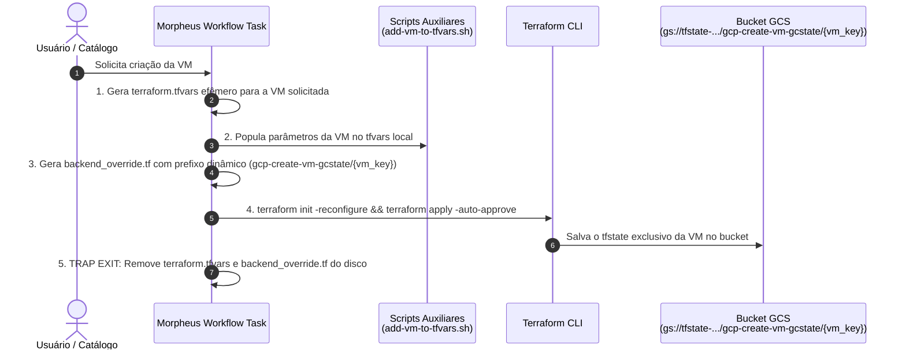

# PoC: App Blueprint no Morpheus Data com Remote State no GCS e Variáveis no Cypher

## O que será implantado

Esta PoC usa o provider Terraform [`HPE/hpe`](https://registry.terraform.io/providers/HPE/hpe/latest)
para criar, no Morpheus Data, um item de catálogo de self-service (publicado
como **App Blueprint** para o solicitante final) para provisionar instâncias Compute Engine no GCP com backend remoto no Google Cloud Storage (GCS) e gerenciamento de variáveis centralizado e seguro no **Morpheus Cypher**:

- exibe um **formulário** com os parâmetros aceitos por
  `scripts/add-vm-to-tfvars.sh` (chave e nome da VM, tipo de máquina, disco,
  imagem de boot, IP externo, usuário/chave SSH, rede, CIDRs de firewall,
  Org Policy e grupos do usuário remoto);
- ao ser executado, dispara uma **task de shell script** que:
  1. gera dinamicamente o arquivo temporário `terraform.tfvars` exclusivo para a VM solicitada;
  2. configura o backend GCS apontando para um prefixo de estado isolado (`prefix = "gcp-create-vm-gcstate/<vm_key>"`);
  3. executa `terraform init -reconfigure`, `terraform validate` e `terraform apply -auto-approve` com backend GCS isolado;
  4. remove todos os arquivos efêmeros do disco local via `trap cleanup EXIT`.

---

## Fluxo da Arquitetura (GCS State Isolado por Instância)



---

### Por que não usar `hpe_morpheus_app_blueprint_terraform` diretamente

O provider HPE possui um recurso literalmente chamado `hpe_morpheus_app_blueprint_terraform`,
mas ele foi desenhado para que o **próprio Morpheus** execute um conteúdo
Terraform como a aplicação implantada (o blueprint É o Terraform). Ele não
oferece, de forma nativa, o fluxo "executar um script → depois aplicar um
manifesto Terraform separado" descrito nesta PoC.

A combinação de recursos abaixo é o equivalente funcional mais próximo do
comportamento pedido, e é o padrão recomendado pelo próprio provider para
"formulário de self-service que dispara uma automação e gerencia o ciclo de vida":

| Recurso Terraform                        | Papel no Morpheus Data                                             |
|-------------------------------------------|---------------------------------------------------------------------|
| `hpe_morpheus_cypher_secret`              | Armazena credenciais GCP no Cypher (`secret/gcp-terraform-ansible-samples`) |
| `hpe_morpheus_option_type_text/number/checkbox` | Cada campo do formulário exibido ao solicitante                |
| `hpe_morpheus_task_shell_script` (add)    | Script que roda `add_vm_and_apply.sh` com estado isolado no GCS     |
| `hpe_morpheus_task_shell_script` (remove) | Script que roda `remove_vm_and_apply.sh` (destroy no state da VM)    |
| `hpe_morpheus_workflow_operational` (add) | Agrupa os campos do formulário e a task de criação                 |
| `hpe_morpheus_workflow_operational` (del) | Agrupa os campos de identificação e a task de exclusão sob demanda |
| `hpe_morpheus_workflow_provisioning`      | Provisioning Workflow com fase **Teardown** para exclusão automática|
| `hpe_morpheus_catalog_item_workflow`      | Publica os workflows no catálogo de self-service do Morpheus       |

Todos os arquivos `.tf` desta PoC estão documentados com o objetivo de cada
recurso; consulte-os para o detalhamento de cada bloco.

## Ciclo de Vida e Desprovisionamento Automático (Teardown)

Nesta PoC, a exclusão de VMs e a destruição dos recursos no GCS acontecem de duas maneiras:

1. **Exclusão Automática via Teardown (Lifecycle Hook)**:
   - Ao vincular o Provisioning Workflow (`vm-provisioning-workflow`) à instância, quando qualquer usuário clica em **Delete** na interface do Morpheus, a fase **Teardown** é disparada automaticamente.
   - O template [`remove_vm_and_apply.sh`](./templates/remove_vm_and_apply.sh) captura o identificador da VM, aponta o backend GCS para o prefixo daquela instância (`gcp-create-vm-gcstate/{vm_key}`) e executa `terraform destroy -auto-approve`.
   - A VM é destruída no GCP e seu estado no GCS é limpo sem afetar nenhuma outra VM.

2. **Exclusão sob demanda via Catálogo de Self-Service**:
   - Disponível pelo item de catálogo de remoção sob demanda.
   - O solicitante informa a chave ou o nome da VM que deseja desativar. O workflow executa o `terraform destroy` no estado isolado daquela instância no GCS.

## Estratégia de Armazenamento de Estado (`tfstate`) e Variáveis (`tfvars`)

Nesta arquitetura, adota-se o padrão **100% Stateless no runner e Isolado por Instância no GCS**:

1. **Execuções Manuais / Locais (Desenvolvimento)**:
   O arquivo de manifesto local **não declara nenhum bloco `backend`**. Com isso, qualquer execução direta (`terraform init` / `apply`) no computador do desenvolvedor armazena o estado no backend **local** (`terraform.tfstate`), sem exigir conexão ou criação de buckets no Google Cloud.

2. **Execuções Automatizadas via Morpheus Data (Remoto / GCS Isolado)**:
   - Cada instância criada pelo catálogo recebe seu próprio caminho isolado no bucket GCS: `gs://<bucket>/gcp-create-vm-gcstate/<vm_key>/default.tfstate`.
   - Quando a Shell Task [`add_vm_and_apply.sh`](./templates/add_vm_and_apply.sh) é disparada pelo Morpheus, ela gera temporariamente um arquivo de sobreposição chamado `backend_override.tf` contendo a declaração do backend GCS isolado:

   ```hcl
   terraform {
     backend "gcs" {
       bucket = "tfstate-devopsvanilla-samples"
       prefix = "gcp-create-vm-gcstate/vm_app_01"
     }
   }
   ```

   Em seguida, o script executa `terraform init -reconfigure` para conectar ao state daquela VM específica e, ao término da execução, um `trap` remove automaticamente o arquivo `backend_override.tf` e o `terraform.tfvars`, mantendo o repositório limpo, seguro e sem risco de concorrência.

### Suporte a Outros Backends Remotos

Embora o script da PoC gere a configuração para o **Google Cloud Storage (`gcs`)**, a mesma estratégia de `override` permite alternar para **qualquer backend remoto oficial do Terraform** (AWS S3, Azure Blob, HashiCorp Consul, HTTP, etc.) apenas ajustando o bloco gerado no script.

### Comparativo com o Native State (Cypher)

Caso prefira não utilizar um bucket remoto (como GCS) e gerenciar o `tfstate` diretamente no cofre nativo do Morpheus Data (Cypher), consulte a PoC [`morpheus-tf-nativestate`](../morpheus-tf-nativestate/README.md) e o guia detalhado de recuperação de state e correção de drift em [`HOWTO-tfstate-drift.md`](../morpheus-tf-nativestate/HOWTO-tfstate-drift.md).

## Pré-requisitos

- Terraform `>= 1.6` e acesso à internet para baixar o provider `HPE/hpe >= 1.6.0`.
- Uma instância do Morpheus Data acessível, com um usuário/senha ou access
  token com permissão para criar option types, tasks, workflows, secrets no Cypher e itens de catálogo.
- O host onde a **task** será executada (`task_execute_target`, padrão `local`
  = o próprio Morpheus; também suporta `remote` e `resource`) precisa ter:
  - O repositório Git sincronizado no Morpheus Data com o seu respectivo **ID de repositório** (informado em `task_repository_id` no `terraform.tfvars` ou via integração Git em `git_integration_name` / `git_repository_name`);
  - `bash`, `python3` (usado por `add-vm-to-tfvars.sh` e pela sincronização do Cypher), `terraform` e
    `gcloud`/ADC configurado com permissão para o projeto GCP alvo;
  - o bucket de state remoto já criado (`./scripts/create-tfstate-bucket.sh`), pois a task executa `terraform init` sem a flag `-migrate-state`.
- Se `task_execute_target = "remote"`, defina também `remote_target_host`,
  `remote_target_port`, `remote_target_username` e `remote_target_password`.
- Copie `terraform.tfvars-SAMPLE` para `terraform.tfvars` e preencha os
  valores reais (incluindo `task_repository_id`). **Nunca versione `terraform.tfvars` com credenciais.**

## Como implantar

1. Acesse o diretório `PoCs/morpheus-tf-remotestate`.
2. Copie o arquivo de exemplo e ajuste os valores:
   - `cp terraform.tfvars-SAMPLE terraform.tfvars`
3. Execute o fluxo padrão do Terraform:
   - `terraform init`
   - `terraform fmt`
   - `terraform validate`
   - `terraform plan`
4. Aplique os objetos no Morpheus Data:
   - `terraform apply`
5. No Morpheus Data, acesse **Self-Service > Catalog** e localize o item com
   o nome definido em `blueprint_name`.
6. Clique em **Order**, preencha o formulário com os mesmos dados que você
   passaria para `scripts/add-vm-to-tfvars.sh` (chave/nome da VM, tipo de
   máquina, disco, imagem, IP externo, SSH, rede, CIDRs, Org Policy e grupos)
   e confirme.

## Como conferir a implantação

- Confirmar os objetos criados via outputs Terraform:
  - `terraform output task_id`
  - `terraform output workflow_id`
  - `terraform output catalog_item_id`
  - `terraform output catalog_item_name`
  - `terraform output remove_task_id`
  - `terraform output provisioning_workflow_id`
  - `terraform output remove_catalog_item_id`
- No Morpheus Data, em **Tools > Cypher**, confirmar que a chave `secret/tfvars-gcp-create-vm-gcstate` foi criada.
- Em **Library > Workflows > Operational**, confirmar que os workflows de criação e remoção aparecem associados às suas tasks.
- Em **Library > Workflows > Provisioning**, confirmar que o provisioning workflow aparece com a task de remoção configurada na fase **Teardown**.
- **Testando a Criação**:
  - No Morpheus Data, acesse **Self-Service > Catalog**, lance o item de catálogo, preencha o formulário e confirme o pedido.
  - Acompanhe em **Provisioning > Executions** a criação da VM e a atualização do Cypher.
- **Testando a Exclusão Automática (Teardown)**:
  - Ao excluir a instância pelo Morpheus (ou via item de catálogo de remoção), acompanhe a execução da task `remove-vm-from-tfvars-and-apply`.
  - Verifique se a entrada foi removida do Cypher e se a VM foi destruída no GCP e desregistrada do `tfstate` no GCS.

## Como descomissionar

- Para remover **apenas os objetos criados no Morpheus Data** por esta PoC
  (cypher secret, option types, task, workflow e item de catálogo):
  - `terraform destroy`
- Isso **não** destrói nenhuma VM provisionada na GCP através das execuções
  do App Blueprint. Para descomissionar as VMs criadas, remova-as via interface do Morpheus ou via script de remoção.

## Guia de erros comuns

- **Erro de autenticação no provider (`401`/`403`)**: revise
  `morpheus_url`, `morpheus_username`/`morpheus_password` (ou
  `morpheus_access_token`) e `morpheus_tenant_subdomain` em `terraform.tfvars`.
- **Task falha com "Repositório não encontrado" ou "Script não encontrado
  ou não executável"**: confirme que `repo_path` aponta para uma cópia
  válida deste repositório no host de execução da task, e que
  `scripts/add-vm-to-tfvars.sh` tem permissão de execução (`chmod +x`).
- **Task falha durante `terraform validate`/`apply`**: normalmente indica
  que `add-vm-to-tfvars.sh` já validou o manifesto com sucesso, mas o
  ambiente do host de execução não tem `gcloud`/ADC configurado, ou o
  bucket de state remoto não existe. Rode
  `./scripts/create-tfstate-bucket.sh --project-id <PROJETO>` previamente.
- **`vmKey` duplicado**: o próprio `add-vm-to-tfvars.sh` valida duplicidade
  e falha com rollback; escolha uma chave diferente no formulário.
- **Campo `allowedSshCidr` obrigatório**: este campo é intencionalmente
  obrigatório no formulário para evitar liberar SSH para `0.0.0.0/0`;
  informe seu IP público com `/32` ou o CIDR da rede de administração.
- **`terraform plan`/`apply` falha com erro de tipo em `option_types` ou
  `workflow_id`/`task_ids`**: esses atributos exigem número, não string;
  os arquivos desta PoC já usam `tonumber()` nas referências — confirme que
  nenhum valor foi alterado manualmente para string.
