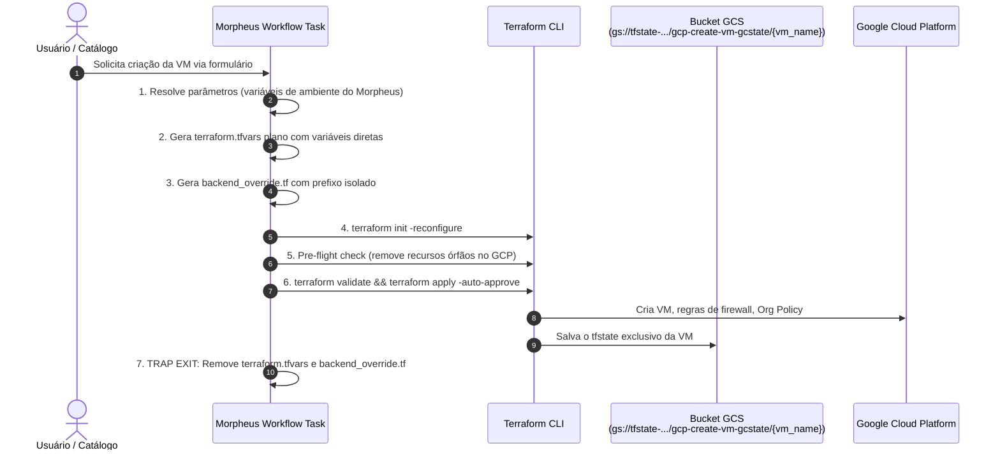
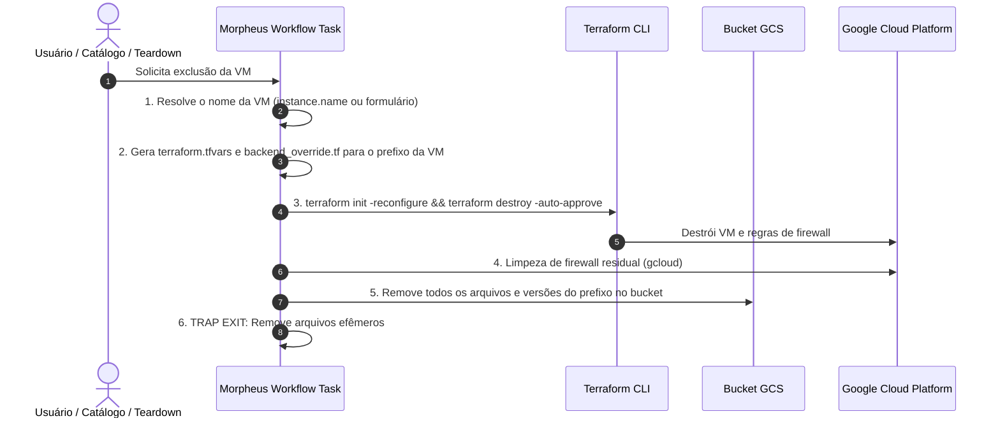

# PoC: App Blueprint no Morpheus Data com Remote State no GCS

## O que será implantado

Esta PoC usa o provider Terraform [`HPE/hpe`](https://registry.terraform.io/providers/HPE/hpe/latest)
para criar, no Morpheus Data, um item de catálogo de self-service para provisionar instâncias Compute Engine no GCP com backend remoto no Google Cloud Storage (GCS) e gerenciamento de credenciais centralizado e seguro no **Morpheus Cypher**:

- exibe um **formulário** com os parâmetros da VM (nome, tipo de máquina, disco,
  imagem de boot, IP externo, usuário/chave SSH, rede, CIDRs de firewall,
  Org Policy e grupos do usuário remoto);
- ao ser executado, dispara uma **task de shell script** que:
  1. gera dinamicamente o arquivo `terraform.tfvars` com variáveis planas exclusivas para a VM solicitada;
  2. configura o backend GCS apontando para um prefixo de estado isolado (`prefix = "gcp-create-vm-gcstate/<vm_name>"`);
  3. executa `terraform init -reconfigure`, `terraform validate` e `terraform apply -auto-approve`;
  4. remove todos os arquivos efêmeros do disco local via `trap cleanup EXIT`.

---

## Arquitetura

### Modelo de Estado Isolado por Instância

Cada VM provisionada pelo Catálogo recebe seu **próprio arquivo de estado** no bucket GCS, completamente independente das demais:

```text
gs://tfstate-devopsvanilla-samples/
└── gcp-create-vm-gcstate/
    ├── vm_cec_500/
    │   └── default.tfstate       ← Estado da VM vm-cec-500
    ├── vm_cec_501/
    │   └── default.tfstate       ← Estado da VM vm-cec-501
    └── vm_cec_502/
        └── default.tfstate       ← Estado da VM vm-cec-502
```

Esse isolamento garante que:
- **Criar uma nova VM não afeta as existentes**: o Terraform opera apenas no state daquela VM.
- **Excluir uma VM não impacta outras**: o `terraform destroy` é direcionado exclusivamente ao prefixo daquela instância.
- **Não há dependência de mapas acumuladores**: cada solicitação gera variáveis planas diretas (`name`, `machine_type_override`, `disk_size_gb`, etc.).

### Fluxo de Provisionamento (Criação)



### Fluxo de Desprovisionamento (Exclusão)



---

## Recursos Terraform no Morpheus Data

| Recurso Terraform                        | Papel no Morpheus Data                                             |
|-------------------------------------------|---------------------------------------------------------------------|
| `hpe_morpheus_cypher_secret`              | Armazena credenciais GCP no Cypher (`secret/gcp-terraform-ansible-samples`) |
| `hpe_morpheus_option_type_text/number/checkbox` | Cada campo do formulário exibido ao solicitante                |
| `hpe_morpheus_task_shell_script` (add)    | Script que roda `add_vm_and_apply.sh` com estado isolado no GCS     |
| `hpe_morpheus_task_shell_script` (remove) | Script que roda `remove_vm_and_apply.sh` (destroy no state da VM)    |
| `hpe_morpheus_workflow_operational` (add) | Agrupa os campos do formulário e a task de criação                 |
| `hpe_morpheus_workflow_operational` (del) | Agrupa os campos de identificação e a task de exclusão sob demanda |
| `hpe_morpheus_workflow_provisioning`      | Provisioning Workflow com fase **Teardown** para exclusão automática|
| `hpe_morpheus_catalog_item_workflow`      | Publica os workflows no catálogo de self-service do Morpheus       |

### Por que não usar `hpe_morpheus_app_blueprint_terraform` diretamente

O provider HPE possui um recurso literalmente chamado `hpe_morpheus_app_blueprint_terraform`,
mas ele foi desenhado para que o **próprio Morpheus** execute um conteúdo
Terraform como a aplicação implantada (o blueprint É o Terraform). Ele não
oferece, de forma nativa, o fluxo "executar um script → depois aplicar um
manifesto Terraform separado" descrito nesta PoC.

---

## Ciclo de Vida e Desprovisionamento

### Métodos de Exclusão Suportados

| Método de Exclusão | Terraform Destroy | Firewall Limpo | GCS Limpo | Recomendado |
|:---|:---:|:---:|:---:|:---:|
| Catálogo Self-Service (item de remoção) | ✅ | ✅ | ✅ | ✅ |
| Menu Instâncias (com Provisioning Workflow vinculado) | ✅ | ✅ | ✅ | ✅ |
| Lista VMs na Nuvem (Infrastructure > Clouds) | ❌ | ❌ | ❌ | ❌ |
| Console do GCP | ❌ | ❌ | ❌ | ❌ |
| `cleanup-tfstate-bucket.sh` (manual) | ❌ | ❌ | ✅ | ⚠️ |

### Exclusão Automática via Teardown (Lifecycle Hook)

Ao vincular o Provisioning Workflow (`vm-nginx-provisioning-workflow`) à instância, quando qualquer usuário clica em **Delete** na interface do Morpheus (menu Instâncias), a fase **Teardown** é disparada automaticamente.

O template [`remove_vm_and_apply.sh`](./templates/remove_vm_and_apply.sh) captura o identificador da VM, aponta o backend GCS para o prefixo daquela instância e executa `terraform destroy -auto-approve`. A VM é destruída no GCP, as regras de firewall são removidas e o estado no GCS é limpo sem afetar nenhuma outra VM.

### Exclusão sob demanda via Catálogo de Self-Service

Disponível pelo item de catálogo de remoção sob demanda. O solicitante informa o **nome da VM** que deseja desativar. O workflow executa o `terraform destroy` no estado isolado daquela instância no GCS.

### Limitações Conhecidas

> **⚠️ ATENÇÃO**: Excluir uma VM diretamente pela lista **Infrastructure > Clouds > VMs** no Morpheus ou pelo **Console do Google Cloud** **NÃO** aciona o workflow de desprovisionamento. Nesse cenário:
>
> - A VM é removida do GCP, mas as **regras de firewall** (`allow-http` e `allow-ssh`) permanecem no projeto.
> - O **tfstate no GCS permanece** com referências a recursos que já não existem (estado fantasma).
> - Na próxima tentativa de criar uma VM com o mesmo nome, o Terraform pode encontrar um erro `409 alreadyExists` nas regras de firewall.
>
> **Solução Imediata**: Sempre exclua pelo Catálogo de Self-Service ou pelo menu Instâncias (com Provisioning Workflow vinculado). Em caso de exclusão acidental por outro meio, use o script `cleanup-tfstate-bucket.sh` para limpar o estado residual no GCS; o pre-flight check do `add_vm_and_apply.sh` removerá regras de firewall órfãs automaticamente na próxima criação.

### Possibilidades de Contorno e Automação Avançada

Para ambientes de produção onde exclusões manuais ou externas precisam ser interceptadas e tratadas automaticamente sem intervenção humana, existem três abordagens arquiteturais possíveis:

#### 1. Interceptação Event-Driven em Tempo Real no GCP (Cloud Audit Logs + Pub/Sub + Cloud Function)
- **Como funciona**:
  1. Qualquer exclusão no GCP (via Console, `gcloud` ou API) gera um evento no **Cloud Audit Logs** com o método `v1.compute.instances.delete`.
  2. Um **Log Router Sink** filtra esse evento e o publica em um tópico do **Cloud Pub/Sub**.
  3. Uma **Cloud Function** (ou **Cloud Run Job**) consome o evento, extrai o nome da instância deletada e dispara o desprovisionamento automático (executa `terraform destroy` no prefixo `gcp-create-vm-gcstate/<nome_da_vm>` ou aciona o webhook de remoção do Morpheus).
- **Vantagem**: Resposta imediata em tempo real (poucos segundos) e independência de onde a exclusão partiu.

#### 2. Interceptação via Ciclo de Descoberta do Morpheus (Cloud Sync Hooks)
- **Como funciona**:
  1. O Morpheus executa rotinas periódicas de **Cloud Sync** para inventariar os recursos da nuvem GCP.
  2. Ao identificar que uma instância gerenciada não existe mais na nuvem (status passa a *unmanaged* ou *removed*), o Morpheus dispara uma **Policy / Event Handler**.
  3. O evento executa a Task operacional de remoção ([`remove_vm_and_apply.sh`](./templates/remove_vm_and_apply.sh)), limpando o `tfstate` e os resíduos no GCS.
- **Vantagem**: Mantém toda a gestão, logs e auditoria centralizados na interface do Morpheus Data.

#### 3. Reconciliação Periódica de Drift (Safety Net / Scheduled Task)
- **Como funciona**:
  1. Um script agendado (via Cron no runner, Cloud Scheduler ou Scheduled Task no Morpheus) roda em intervalos regulares (ex.: a cada 1 hora ou diariamente).
  2. O script consulta todos os prefixos de VMs existentes no bucket GCS (`vm_cec_500`, `vm_cec_501`, etc.) e verifica se a instância correspondente ainda existe no GCP (`gcloud compute instances describe <nome>`).
  3. Caso a VM tenha sido deletada externamente, o job executa o expurgo do `tfstate` no GCS e remove eventuais regras de firewall residuais.
- **Vantagem**: Simplicidade operacional, atuando como um *reconciliation loop* para garantir consistência contínua do ambiente.

| Abordagem de Contorno | Onde Intercepta | Tempo de Resposta | Complexidade |
| :--- | :--- | :--- | :--- |
| **Audit Logs + Pub/Sub + Cloud Function** | Direto na GCP | Imediato (segundos) | Média |
| **Morpheus Cloud Sync Hooks** | No Morpheus Data | Médio (intervalo de sync) | Média |
| **Job de Reconciliação (Cron / Scheduler)** | Script periódico | Periódico (ex.: 1h) | Baixa |


---

## Estratégia de Armazenamento de Estado (`tfstate`)

Nesta arquitetura, adota-se o padrão **100% Stateless no runner e Isolado por Instância no GCS**:

1. **Execuções Manuais / Locais (Desenvolvimento)**:
   O arquivo de manifesto local **não declara nenhum bloco `backend`**. Com isso, qualquer execução direta (`terraform init` / `apply`) no computador do desenvolvedor armazena o estado no backend **local** (`terraform.tfstate`), sem exigir conexão ou criação de buckets no Google Cloud.

2. **Execuções Automatizadas via Morpheus Data (Remoto / GCS Isolado)**:
   - Cada instância criada pelo catálogo recebe seu próprio caminho isolado no bucket GCS: `gs://<bucket>/gcp-create-vm-gcstate/<vm_name>/default.tfstate`.
   - Quando a Shell Task [`add_vm_and_apply.sh`](./templates/add_vm_and_apply.sh) é disparada pelo Morpheus, ela gera temporariamente um arquivo de sobreposição chamado `backend_override.tf` contendo a declaração do backend GCS isolado:

   ```hcl
   terraform {
     backend "gcs" {
       bucket = "tfstate-devopsvanilla-samples"
       prefix = "gcp-create-vm-gcstate/vm_cec_500"
     }
   }
   ```

   Em seguida, o script executa `terraform init -reconfigure` para conectar ao state daquela VM específica e, ao término da execução, um `trap` remove automaticamente o arquivo `backend_override.tf` e o `terraform.tfvars`, mantendo o repositório limpo, seguro e sem risco de concorrência.

### Suporte a Outros Backends Remotos

Embora o script da PoC gere a configuração para o **Google Cloud Storage (`gcs`)**, a mesma estratégia de `override` permite alternar para **qualquer backend remoto oficial do Terraform** (AWS S3, Azure Blob, HashiCorp Consul, HTTP, etc.) apenas ajustando o bloco gerado no script.

### Comparativo com o Native State (Cypher)

Caso prefira não utilizar um bucket remoto (como GCS) e gerenciar o `tfstate` diretamente no cofre nativo do Morpheus Data (Cypher), consulte a PoC [`morpheus-tf-nativestate`](../morpheus-tf-nativestate/README.md) e o guia detalhado de recuperação de state e correção de drift em [`HOWTO-tfstate-drift.md`](../morpheus-tf-nativestate/HOWTO-tfstate-drift.md).

---

## Script de Inspeção e Limpeza de Estado (`cleanup-tfstate-bucket.sh`)

O script [`scripts/cleanup-tfstate-bucket.sh`](../../scripts/cleanup-tfstate-bucket.sh) permite inspecionar e gerenciar os estados armazenados no bucket GCS.

### Uso

```text
Uso:
  cleanup-tfstate-bucket.sh --project-id <project-id> [opções]

Opções obrigatórias:
  --project-id <id>             ID do projeto GCP onde o bucket está localizado

Opções gerais:
  --bucket-name <nome>          Nome do bucket GCS (padrão: tfstate-devopsvanilla-samples)
  --prefix <prefixo>            Prefixo do estado a ser limpo (padrão: gcp-create-vm-gcstate)
  --vm, --vm-key <nome>         Limpa apenas o estado de uma VM específica
  --all                         Limpa todos os objetos e prefixos de dentro do bucket
  --delete-bucket               Exclui o bucket GCS completamente após limpar seu conteúdo
  --dry-run                     Apenas lista os objetos que seriam excluídos, sem apagá-los
  -f, --force                   Executa sem pedir confirmação interativa
  -h, --help                    Exibe esta ajuda
```

### Exemplos de Uso

#### 1. Inspecionar todas as VMs e seus recursos (dry-run)

Exibe os estados de todas as VMs provisionadas, incluindo os recursos GCP registrados no tfstate de cada uma:

```bash
./scripts/cleanup-tfstate-bucket.sh --dry-run
```

Saída:

```text
[INFO] Project ID detectado automaticamente via gcloud: poc-terraform-ansible
[INFO] Verificando existência do bucket gs://tfstate-devopsvanilla-samples no projeto poc-terraform-ansible...
[INFO] Consultando objetos em gs://tfstate-devopsvanilla-samples/gcp-create-vm-gcstate...

[INFO] === [DRY-RUN] Instâncias e Recursos Provisionados ===

  📦 Instância: vm_cec_500
     Prefixo:   gs://tfstate-devopsvanilla-samples/gcp-create-vm-gcstate/vm_cec_500
     Recursos no tfstate:
       • google_compute_firewall.allow_http ["vm-cec-500"]  (name=gcp-create-vm-gcstate-vm-cec-500-allow-http, direction=INGRESS)
       • google_compute_firewall.allow_ssh ["vm-cec-500"]  (name=gcp-create-vm-gcstate-vm-cec-500-allow-ssh, direction=INGRESS)
       • google_compute_instance.vm ["vm-cec-500"]  (name=vm-cec-500, zone=us-central1-a, type=e2-micro, ip=136.64.248.9)
       • google_project_service.compute_engine  (id=poc-terraform-ansible/compute.googleapis.com)

  📦 Instância: vm_cec_501
     Prefixo:   gs://tfstate-devopsvanilla-samples/gcp-create-vm-gcstate/vm_cec_501
     Recursos no tfstate:
       • google_compute_firewall.allow_http ["vm-cec-501"]  (name=gcp-create-vm-gcstate-vm-cec-501-allow-http, direction=INGRESS)
       • google_compute_firewall.allow_ssh ["vm-cec-501"]  (name=gcp-create-vm-gcstate-vm-cec-501-allow-ssh, direction=INGRESS)
       • google_compute_instance.vm ["vm-cec-501"]  (name=vm-cec-501, zone=us-central1-a, type=e2-micro, ip=34.134.82.217)
       • google_project_service.compute_engine  (id=poc-terraform-ansible/compute.googleapis.com)

  📦 Instância: vm_cec_502
     Prefixo:   gs://tfstate-devopsvanilla-samples/gcp-create-vm-gcstate/vm_cec_502
     Recursos no tfstate:
       • google_compute_firewall.allow_http ["vm-cec-502"]  (name=gcp-create-vm-gcstate-vm-cec-502-allow-http, direction=INGRESS)
       • google_compute_firewall.allow_ssh ["vm-cec-502"]  (name=gcp-create-vm-gcstate-vm-cec-502-allow-ssh, direction=INGRESS)
       • google_compute_instance.vm ["vm-cec-502"]  (name=vm-cec-502, zone=us-central1-a, type=e2-micro, ip=34.123.108.25)
       • google_project_service.compute_engine  (id=poc-terraform-ansible/compute.googleapis.com)

[INFO] === [DRY-RUN] Detalhamento de Arquivos e Versões (Object Versioning) ===
  ℹ️  O sufixo '#<geração>' representa uma versão/backup histórico de alterações no mesmo arquivo.
  • gs://tfstate-devopsvanilla-samples/gcp-create-vm-gcstate/vm_cec_500/default.tflock#1787790359009846
  • gs://tfstate-devopsvanilla-samples/gcp-create-vm-gcstate/vm_cec_500/default.tfstate#1787790424555366
  ...

[INFO] [DRY-RUN] Simulação concluída com sucesso. Nenhuma alteração foi realizada.
```

#### 2. Inspecionar uma VM específica (dry-run)

```bash
./scripts/cleanup-tfstate-bucket.sh --vm vm_cec_500 --dry-run
```

Saída:

```text
[INFO] Project ID detectado automaticamente via gcloud: poc-terraform-ansible
[INFO] Verificando existência do bucket gs://tfstate-devopsvanilla-samples no projeto poc-terraform-ansible...
[INFO] Consultando objetos em gs://tfstate-devopsvanilla-samples/gcp-create-vm-gcstate/vm_cec_500...

[INFO] === [DRY-RUN] Instâncias e Recursos Provisionados ===

  📦 Instância: vm_cec_500
     Prefixo:   gs://tfstate-devopsvanilla-samples/gcp-create-vm-gcstate/vm_cec_500
     Recursos no tfstate:
       • google_compute_firewall.allow_http ["vm-cec-500"]  (name=gcp-create-vm-gcstate-vm-cec-500-allow-http, direction=INGRESS)
       • google_compute_firewall.allow_ssh ["vm-cec-500"]  (name=gcp-create-vm-gcstate-vm-cec-500-allow-ssh, direction=INGRESS)
       • google_compute_instance.vm ["vm-cec-500"]  (name=vm-cec-500, zone=us-central1-a, type=e2-micro, ip=136.64.248.9)
       • google_project_service.compute_engine  (id=poc-terraform-ansible/compute.googleapis.com)

[INFO] === [DRY-RUN] Detalhamento de Arquivos e Versões (Object Versioning) ===
  ℹ️  O sufixo '#<geração>' representa uma versão/backup histórico de alterações no mesmo arquivo.
  • gs://tfstate-devopsvanilla-samples/gcp-create-vm-gcstate/vm_cec_500/default.tflock#1787790359009846
  • gs://tfstate-devopsvanilla-samples/gcp-create-vm-gcstate/vm_cec_500/default.tflock#1787790374587344
  • gs://tfstate-devopsvanilla-samples/gcp-create-vm-gcstate/vm_cec_500/default.tfstate#1787790359945526
  • gs://tfstate-devopsvanilla-samples/gcp-create-vm-gcstate/vm_cec_500/default.tfstate#1787790423762420
  • gs://tfstate-devopsvanilla-samples/gcp-create-vm-gcstate/vm_cec_500/default.tfstate#1787790424555366

[INFO] [DRY-RUN] Simulação concluída com sucesso. Nenhuma alteração foi realizada.
```

#### 3. Limpar o estado de uma VM específica

```bash
./scripts/cleanup-tfstate-bucket.sh --vm vm_cec_500
```

#### 4. Limpar todos os estados da PoC

```bash
./scripts/cleanup-tfstate-bucket.sh --project-id poc-terraform-ansible
```

#### 5. Limpar todo o bucket e excluí-lo

```bash
./scripts/cleanup-tfstate-bucket.sh --project-id poc-terraform-ansible --delete-bucket
```

---

## Pré-requisitos

- Terraform `>= 1.6` e acesso à internet para baixar o provider `HPE/hpe >= 1.6.0`.
- Uma instância do Morpheus Data acessível, com um usuário/senha ou access
  token com permissão para criar option types, tasks, workflows, secrets no Cypher e itens de catálogo.
- O host onde a **task** será executada (`task_execute_target`, padrão `local`
  = o próprio Morpheus; também suporta `remote` e `resource`) precisa ter:
  - O repositório Git sincronizado no Morpheus Data com o seu respectivo **ID de repositório** (informado em `task_repository_id` no `terraform.tfvars` ou via integração Git em `git_integration_name` / `git_repository_name`);
  - `bash`, `python3`, `terraform` e `gcloud`/ADC configurado com permissão para o projeto GCP alvo;
  - o bucket de state remoto já criado (`./scripts/create-tfstate-bucket.sh`), pois a task executa `terraform init` sem a flag `-migrate-state`.
- Se `task_execute_target = "remote"`, defina também `remote_target_host`,
  `remote_target_port`, `remote_target_username` e `remote_target_password`.
- Copie `terraform.tfvars-SAMPLE` para `terraform.tfvars` e preencha os
  valores reais (incluindo `task_repository_id`). **Nunca versione `terraform.tfvars` com credenciais.**

## Como implantar

1. Acesse o diretório `PoCs/morpheus-tf-remotestate`.
2. Copie o arquivo de exemplo e ajuste os valores:
   - `cp terraform.tfvars-SAMPLE terraform.tfvars`
3. Execute o fluxo padrão do Terraform:
   - `terraform init`
   - `terraform fmt`
   - `terraform validate`
   - `terraform plan`
4. Aplique os objetos no Morpheus Data:
   - `terraform apply`
5. No Morpheus Data, acesse **Self-Service > Catalog** e localize o item com
   o nome definido em `blueprint_name`.
6. Clique em **Order**, preencha o formulário com os dados da VM desejada
   (nome, tipo de máquina, disco, imagem, IP externo, SSH, rede, CIDRs,
   Org Policy e grupos) e confirme.

## Como conferir a implantação

- Confirmar os objetos criados via outputs Terraform:
  - `terraform output task_id`
  - `terraform output workflow_id`
  - `terraform output catalog_item_id`
  - `terraform output catalog_item_name`
  - `terraform output remove_task_id`
  - `terraform output provisioning_workflow_id`
  - `terraform output remove_catalog_item_id`
- No Morpheus Data, em **Tools > Cypher**, confirmar que a chave `secret/tfvars-gcp-create-vm-gcstate` foi criada.
- Em **Library > Workflows > Operational**, confirmar que os workflows de criação e remoção aparecem associados às suas tasks.
- Em **Library > Workflows > Provisioning**, confirmar que o provisioning workflow aparece com a task de remoção configurada na fase **Teardown**.
- **Testando a Criação**:
  - No Morpheus Data, acesse **Self-Service > Catalog**, lance o item de catálogo, preencha o formulário e confirme o pedido.
  - Acompanhe em **Provisioning > Executions** a criação da VM e a atualização do Cypher.
- **Testando a Exclusão Automática (Teardown)**:
  - Ao excluir a instância pelo Morpheus (menu Instâncias) ou via item de catálogo de remoção, acompanhe a execução da task de remoção.
  - Verifique se a VM foi destruída no GCP e se o estado foi removido do bucket GCS.

## Como descomissionar

- Para remover **apenas os objetos criados no Morpheus Data** por esta PoC
  (cypher secret, option types, task, workflow e item de catálogo):
  - `terraform destroy`
- Isso **não** destrói nenhuma VM provisionada na GCP através das execuções
  do App Blueprint. Para descomissionar as VMs criadas, remova-as via item de catálogo de remoção ou pelo menu Instâncias (com Provisioning Workflow vinculado).

## Guia de erros comuns

- **Erro de autenticação no provider (`401`/`403`)**: revise
  `morpheus_url`, `morpheus_username`/`morpheus_password` (ou
  `morpheus_access_token`) e `morpheus_tenant_subdomain` em `terraform.tfvars`.
- **Task falha com "Repositório não encontrado"**: confirme que
  `repo_path` aponta para uma cópia válida deste repositório no host de execução da task.
- **Task falha com "Failed to parse template script"**: o motor de templates Groovy do Morpheus interpreta sequências `<%` como expressões de template. As variáveis do script já são construídas dinamicamente para evitar esse conflito.
- **Erro `409 alreadyExists` ao criar VM**: indica recursos órfãos (regras de firewall) de uma execução anterior cujo estado foi perdido. O pre-flight check do `add_vm_and_apply.sh` detecta e remove esses resquícios automaticamente. Caso persista, limpe os estados com `cleanup-tfstate-bucket.sh` e remova as regras manualmente via `gcloud compute firewall-rules delete`.
- **Task falha durante `terraform validate`/`apply`**: normalmente indica
  que o ambiente do host de execução não tem `gcloud`/ADC configurado, ou o
  bucket de state remoto não existe. Rode
  `./scripts/create-tfstate-bucket.sh --project-id <PROJETO>` previamente.
- **Campo `allowedSshCidr` obrigatório**: este campo é intencionalmente
  obrigatório no formulário para evitar liberar SSH para `0.0.0.0/0`;
  informe seu IP público com `/32` ou o CIDR da rede de administração.
- **`terraform plan`/`apply` falha com erro de tipo em `option_types` ou
  `workflow_id`/`task_ids`**: esses atributos exigem número, não string;
  os arquivos desta PoC já usam `tonumber()` nas referências — confirme que
  nenhum valor foi alterado manualmente para string.
