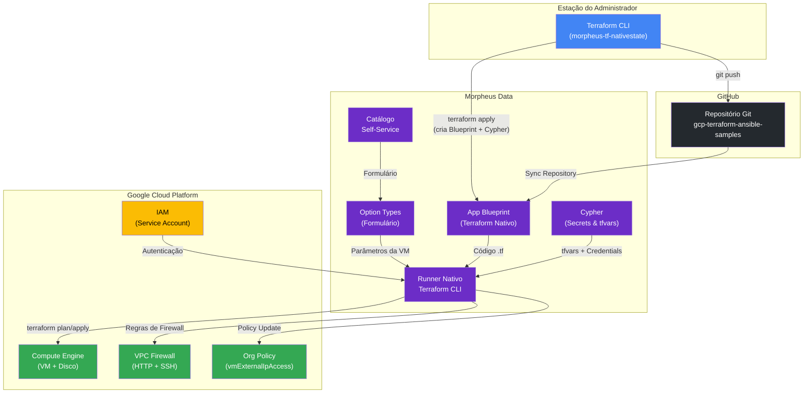
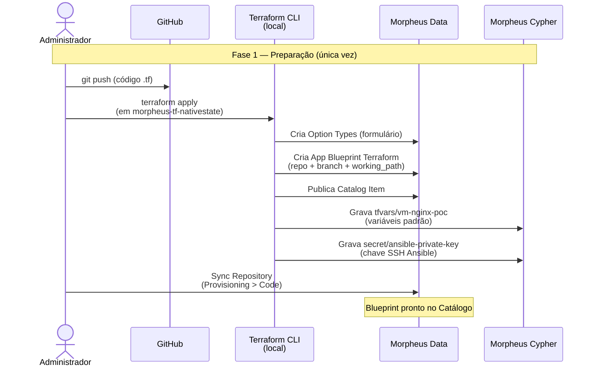
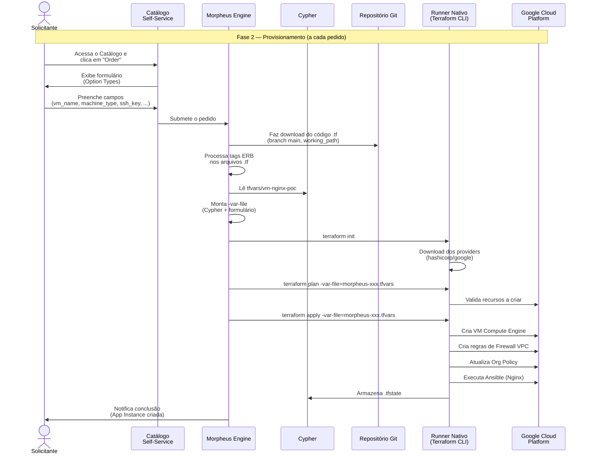
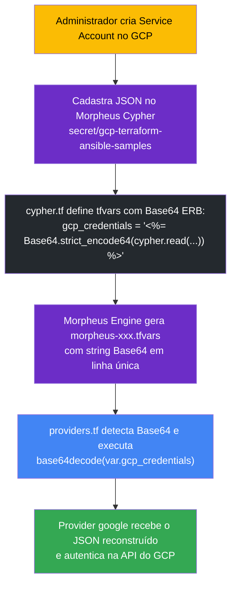
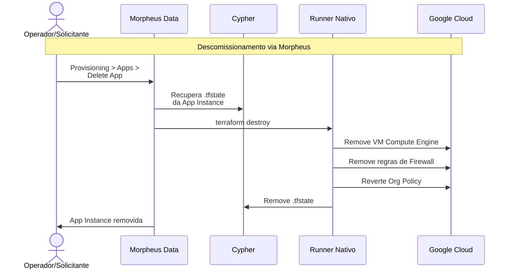

# Arquitetura: Fluxo de Provisionamento e Autenticação via Morpheus Data

Este documento descreve a **arquitetura de ponta a ponta** do provisionamento de VMs no Google Cloud Platform (GCP) através do Morpheus Data, incluindo os fluxos de autenticação, injeção de credenciais e o ciclo de vida completo desde o código-fonte no Git até a instância Compute Engine operacional na GCP.

> 📖 **Documentos Relacionados:**
> - **Provisionamento e Descomissionamento da VM**: [`README.md`](./README.md)
> - **Automação do Blueprint no Morpheus Data**: [`PoCs/morpheus-tf-nativestate/README.md`](../morpheus-tf-nativestate/README.md)
> - **Configuração de Conectividade GCP, GitHub e Cypher**: [`PoCs/morpheus-tf-nativestate/HOWTO-gcloud-connect.md`](../morpheus-tf-nativestate/HOWTO-gcloud-connect.md)

---

## 1. Visão Geral dos Componentes

A solução integra quatro domínios distintos que colaboram para o provisionamento automatizado via Self-Service:



### Componentes e Responsabilidades

| Componente | Localização | Responsabilidade |
|---|---|---|
| **Terraform CLI (Admin)** | Estação local do administrador | Aplica `morpheus-tf-nativestate` para criar o Blueprint, Option Types e secrets no Morpheus |
| **Repositório Git** | GitHub | Armazena o código Terraform (`vm-nginx-terraform-ansible`) e é sincronizado pelo Morpheus |
| **App Blueprint** | Morpheus Data | Define qual repositório, branch e diretório (`working_path`) o runner Terraform deve executar |
| **Catálogo Self-Service** | Morpheus Data | Interface amigável onde o usuário solicita a criação de VMs |
| **Option Types (Formulário)** | Morpheus Data | Campos de entrada (`vm_name`, `machine_type`, `ssh_public_key`, etc.) preenchidos pelo solicitante |
| **Cypher** | Morpheus Data | Armazena `tfvars` (variáveis), `tfstate` (estado) e segredos (chave SSH Ansible, chave GCP) de forma criptografada |
| **Runner Nativo** | Morpheus Data (servidor) | Executa `terraform init/plan/apply` com as variáveis e credenciais injetadas |
| **Service Account GCP** | Google Cloud IAM | Identidade de máquina que autoriza o Terraform a criar recursos no GCP |

> 📌 **Configuração dos Componentes:** Para instruções detalhadas de como configurar cada componente, consulte o guia [`HOWTO-gcloud-connect.md`](../morpheus-tf-nativestate/HOWTO-gcloud-connect.md):
> - **Service Account e IAM GCP**: [Seção 2 — Permissões e Recursos no GCP](../morpheus-tf-nativestate/HOWTO-gcloud-connect.md#2-permissões-e-recursos-a-criar-antecipadamente-no-gcp)
> - **Credenciais GCP no Morpheus**: [Seção 3 — Formas de Conectar Credenciais](../morpheus-tf-nativestate/HOWTO-gcloud-connect.md#3-formas-de-conectar-as-credenciais-gcp-no-morpheus-data)
> - **Integração do Repositório Git**: [Seção 4 — Conexão do Repositório GitHub](../morpheus-tf-nativestate/HOWTO-gcloud-connect.md#4-conexão-do-repositório-github-no-morpheus-data)
> - **Segredos no Cypher**: [Seção 5 — Estrutura e Configuração do Cypher](../morpheus-tf-nativestate/HOWTO-gcloud-connect.md#5-estrutura-e-configuração-do-morpheus-cypher)

---

## 2. Fluxo de Provisionamento (Git → Morpheus → GCP)

O provisionamento completo ocorre em duas fases distintas: a **preparação** (feita uma vez pelo administrador) e a **execução** (feita pelo solicitante a cada pedido no Catálogo).

### Fase 1: Preparação (Administrador)

Executada **uma única vez** pelo administrador para registrar o Blueprint e os segredos no Morpheus Data.



> 📌 **Passos de Configuração:** Consulte o [`README.md` do morpheus-tf-nativestate](../morpheus-tf-nativestate/README.md#como-implantar) para o passo a passo detalhado desta fase.

### Fase 2: Execução (Solicitante no Catálogo)

Executada pelo **usuário final** a cada pedido de nova VM no Catálogo Self-Service do Morpheus Data.



---

## 3. Fluxo de Autenticação e Credenciais

Existem dois modelos distintos suportados neste repositório para autenticar no Google Cloud Platform (GCP):

### Modelo A: App Blueprint Nativo (`morpheus-tf-nativestate`) — Injeção via Base64 em `tfvar_secret`

No App Blueprint Nativo, o Morpheus gera um arquivo `.tfvars` a partir da chave do Cypher `tfvars/vm-nginx-poc`. Como o JSON da Service Account possui múltiplas linhas e aspas que corrompem o parser de `tfvars` do Morpheus se injetados diretamente, a chave é codificada em **Base64 de linha única** durante a renderização ERB do Cypher.



#### Mecanismo no Código (`providers.tf`)

```hcl
locals {
  raw_gcp_credentials = try(trimspace(var.gcp_credentials), "")
  gcp_credentials_json = (
    local.raw_gcp_credentials == ""
    ? null
    : can(jsondecode(local.raw_gcp_credentials))
    ? local.raw_gcp_credentials
    : can(base64decode(local.raw_gcp_credentials))
    ? base64decode(local.raw_gcp_credentials)
    : local.raw_gcp_credentials
  )
}

provider "google" {
  project               = var.project_id
  region                = var.region
  zone                  = var.zone
  billing_project       = var.project_id
  user_project_override = true
  credentials           = local.gcp_credentials_json
}
```

---

### Modelo B: Operational Workflow / Task (`morpheus-tf-remotestate`) — Padrão `loonar-morpheus-aws-s3-catalog`

No modelo baseado em **Workflow Operacional** (`hpe_morpheus_catalog_item_workflow` + `hpe_morpheus_task_shell_script`), o Morpheus executa um script Shell Bash no runner. 

Neste caso, a tag ERB `<%=cypher.read("secret/gcp-terraform-ansible-samples")%>` é avaliada diretamente pelo interpretador de tarefas do Morpheus e exportada como variável de ambiente `GOOGLE_CREDENTIALS`:

```bash
# Injeção automática em add_vm_and_apply.sh
export GOOGLE_CREDENTIALS='<%=cypher.read("secret/gcp-terraform-ansible-samples")%>'
```

O provider `google` do Terraform lê automaticamente a variável de ambiente `GOOGLE_CREDENTIALS` sem necessidade de qualquer alteração no manifesto HCL.

| Ambiente / Modelo | O que acontece | Resultado |
|---|---|---|
| **App Blueprint (Native)** | Morpheus gera `gcp_credentials = "eyJ0e..."` (Base64) no `.tfvars`. `providers.tf` decodifica automaticamente. | ✅ JSON reconstruído via Base64 |
| **Workflow Task (Shell)** | Script Bash exporta `GOOGLE_CREDENTIALS` no ambiente do runner. | ✅ Provider `google` lê env var nativa |
| **Local com `gcp_credentials`** | Administrador informa JSON bruto ou Base64 em `terraform.tfvars`. | ✅ Variável explícita usada |
| **Local com ADC (`gcloud auth`)** | `var.gcp_credentials` é vazio. `credentials` resolve para `null`. | ✅ Fallback automático para ADC |

### Estrutura dos Segredos no Cypher

```
Morpheus Cypher
├── secret/gcp-terraform-ansible-samples   ← JSON da chave da Service Account GCP
│                                            (cadastro manual, uma vez)
├── tfvars/vm-nginx-poc                    ← Variáveis padrão do Terraform
│                                            (criado automaticamente pelo terraform apply)
├── secret/ansible-private-key             ← Chave privada SSH do Ansible
│                                            (criado automaticamente pelo terraform apply)
└── tfstate/<app-instance-id>              ← Estado .tfstate de cada App Instance
                                             (gerenciado automaticamente pelo Morpheus)
```

> 📌 **Configuração dos Segredos:** Consulte a [Seção 5 do HOWTO-gcloud-connect.md](../morpheus-tf-nativestate/HOWTO-gcloud-connect.md#5-estrutura-e-configuração-do-morpheus-cypher) para instruções detalhadas sobre como criar cada segredo.

---

## 4. Fluxo de Descomissionamento

O descomissionamento segue o caminho inverso, e pode ser iniciado de duas formas:



| Método | Quando Usar | Instruções |
|---|---|---|
| **Via Morpheus (Catálogo)** | Descomissionar uma VM provisionada pelo Self-Service | Acesse *Provisioning > Apps*, selecione a App e clique em **Delete App** |
| **Via Terraform CLI (local)** | Descomissionar quando em execução local (sem Morpheus) | Execute `terraform destroy` no diretório da PoC |
| **Remover o Blueprint** | Desinstalar toda a automação do Morpheus | Execute `terraform destroy` em `morpheus-tf-nativestate` ([instruções](../morpheus-tf-nativestate/README.md#como-descomissionar)) |

> 📌 **Detalhes completos de descomissionamento:** Consulte a seção [Como Descomissionar](./README.md#como-descomissionar) no README principal.

---

## 5. Referências

| Documento | Conteúdo |
|---|---|
| [`README.md`](./README.md) | Recursos provisionados, pré-requisitos, como implantar e descomissionar a VM |
| [`../morpheus-tf-nativestate/README.md`](../morpheus-tf-nativestate/README.md) | Automação do Blueprint, Option Types e Catálogo no Morpheus Data |
| [`../morpheus-tf-nativestate/HOWTO-gcloud-connect.md`](../morpheus-tf-nativestate/HOWTO-gcloud-connect.md) | Configuração de Service Account GCP, integração Git, segredos no Cypher |
| [`../morpheus-tf-nativestate/HOWTO-tfstate-drift.md`](../morpheus-tf-nativestate/HOWTO-tfstate-drift.md) | Gerenciamento de estado `.tfstate` e detecção de drifts |
